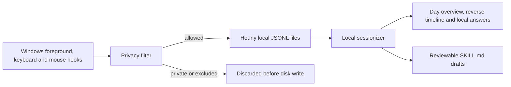

<p align="center">
  
</p>

<h1 align="center">Daytrace</h1>

<p align="center"><strong>Your day. On your device.</strong></p>

<p align="center">
  A free, open-source Windows app that turns local application activity into a useful workday timeline — without screenshots, audio, accounts, APIs, or cloud storage.
</p>

<p align="center">
  <a href="https://github.com/CaspianG/daytrace/releases/latest"><strong>Download for Windows</strong></a>
  · <a href="README_RU.md">Русская версия</a>
  · <a href="SECURITY.md">Security</a>
</p>

<p align="center">
  
  
  
  
</p>


## Why Daytrace exists

The useful question is simple: **“What was I working on this morning?”** The answer is usually scattered across editors, browser tabs, documents, chats, and window switches.

OpenAI's announcement of Computer History validated this new category of desktop software. Its initial rollout was described as macOS-only and limited to Pro, Business, and Enterprise plans. Daytrace is an independent, Windows-first alternative for people who want the utility without a subscription or a hosted activity history.

Daytrace requires no account and no API key. Its shipped desktop runtime contains no network integration: events are captured, filtered, grouped, queried, and deleted on your computer.

> Computer History availability and plan limits may change after the initial announcement. Daytrace is not affiliated with or endorsed by OpenAI.

## Install with the guided setup

1. Open the [latest release](https://github.com/CaspianG/daytrace/releases/latest).
2. Download `Daytrace-Setup-…-x64.exe`.
3. Double-click it. Choose English or Russian, the installation location, and whether to add a Desktop shortcut. The Start Menu shortcut is added automatically.

No administrator account, separate .NET installation, browser extension, cloud account, or API key is required.

The first public build is not code-signed yet, so Windows SmartScreen may show **Unknown publisher**. Check the SHA-256 value published in the release notes before running it.

Prefer a portable build? Download `Daytrace-Portable-…-x64.zip`, extract it, and run `Daytrace.exe`.

Minimizing or closing the window releases the heavy renderer while the lightweight native tracker continues from the system tray. Double-click the tray icon or launch Daytrace again to reopen the same instance.

## What you get

- **A complete day overview** with active time, applications, context switches, browser-tab maximum, focus distribution, top applications, and an hourly rhythm chart.
- **A newest-first timeline** grouped into focus sessions instead of a raw event dump, with previous-day navigation inside the retention window.
- **Local questions about your day**, including morning, afternoon, evening, today, and yesterday.
- **A selected-day summary** showing the main areas of work and how long they took.
- **Richer application context** from Windows event and accessibility APIs: active Chrome tab-title changes, numeric tab count, Telegram active-window/chat-title changes, and idle-aware reading time.
- **Private-window filtering** for common Incognito, InPrivate, and Private Browsing titles before disk writes.
- **Application exclusions** with password managers excluded by default.
- **48-hour retention** with precise automatic pruning of older event lines.
- **Pause, session deletion, and delete-all controls** inside the app.
- **Local workflow detection** that can export a reviewable `SKILL.md` draft from repeated application sequences.
- **Complete English and Russian localization** for the interface, timeline labels, local answers, tray menu, installer, and exported skills.
- **First-run language choice** with an instant language switch available later in Settings.


The same interface is also available in [Russian](README_RU.md), including localized summaries and system-tray controls.

## Privacy model

Daytrace is intentionally less invasive than screenshot-based activity recorders.

| Recorded locally | Never recorded |
| --- | --- |
| Active application name | Screenshots or screen video |
| Active window title | Audio or microphone input |
| Numeric count of visible browser tabs | URLs or titles of background tabs |
| Window-switch timestamp | Clipboard contents |
| Aggregate click count | Mouse coordinates |
| Aggregate keypress count | Key identities or typed text |
| Session duration | Form values or passwords |

Window titles can contain document names, page titles, or conversation names. They stay local, but you should exclude sensitive applications. Private-browser detection is title-based because browsers do not expose one universal private-mode signal; treat exclusions as the stronger control.

Default data location:

```text
%APPDATA%\daytrace-local\daytrace-data\
├── events\YYYY-MM-DD-HH.jsonl
├── settings.json
└── skills\<workflow>\SKILL.md
```

Uninstalling the application preserves this folder so history is not destroyed unexpectedly. Use **Delete all data** inside Daytrace if you want to erase the journal first.

## How it works



The native tracker emits foreground-window and active-title changes, idle-aware heartbeats, a once-per-minute numeric browser-tab count, and aggregate input counts. Electron's local main process applies privacy rules, stores hourly JSONL segments, and exposes state to the sandboxed renderer over a narrow IPC bridge. It never reads message bodies, typed text, URLs, or background-tab titles. There is no cloud backend.

## Current limitations

- Windows x64 only; tested on Windows 10/11.
- Local Q&A is deterministic and heuristic — it is not a bundled language model.
- Private-window detection depends on browser title conventions and cannot be guaranteed for every browser/version.
- The installer is not code-signed yet.

These boundaries are documented because privacy software should be explicit about what it can and cannot prove.

## Build from source

Requirements: Node.js 22+, npm, and .NET 8 SDK.

```powershell
git clone https://github.com/CaspianG/daytrace.git
cd daytrace
npm ci
npm run dev:desktop
```

Run verification and produce both installer and portable artifacts:

```powershell
npm test
npm run test:sites
npm run dist
```

Artifacts are written to `release/`:

- `Daytrace-Setup-<version>-x64.exe`
- `Daytrace-Portable-<version>-x64.zip`

## Project status

Daytrace is an early public release. The privacy boundary, retention behavior, bilingual interface, installer cycle, and application launch are tested; broader browser coverage still needs community testing.

Issues and focused pull requests are welcome. Read [CONTRIBUTING.md](CONTRIBUTING.md) before changing capture or privacy behavior.

## License

[MIT](LICENSE) © Daytrace contributors.
