<p align="center">
  
</p>

<h1 align="center">Daytrace</h1>

<p align="center"><strong>Your day. On your device.</strong></p>

<p align="center">
  A free, open-source Windows and macOS app that turns local application activity into a useful workday timeline — without screenshots, audio, accounts, APIs, or cloud storage.
</p>

<p align="center">
  <a href="https://github.com/CaspianG/daytrace/releases/latest"><strong>Download for Windows</strong></a>
  · <a href="docs/MACOS_INSTALL.md"><strong>Install on macOS</strong></a>
  · <a href="README_RU.md">Русская версия</a>
  · <a href="SECURITY.md">Security</a>
</p>

<p align="center"><strong>Current release: v0.5.9</strong> — Windows and macOS artifacts are built from the same tag and published together.</p>

> **macOS first-launch notice:** the current Mac build is free and fully local, but it is not signed or notarized because the project does not have Apple Developer ID credentials. Gatekeeper will therefore warn on first launch. Read the [safe macOS installation guide](docs/MACOS_INSTALL.md) before downloading; it uses Finder's supported **Open** / **Open Anyway** flow and does not disable Gatekeeper.

<p align="center">
  
  
  
  
  
</p>

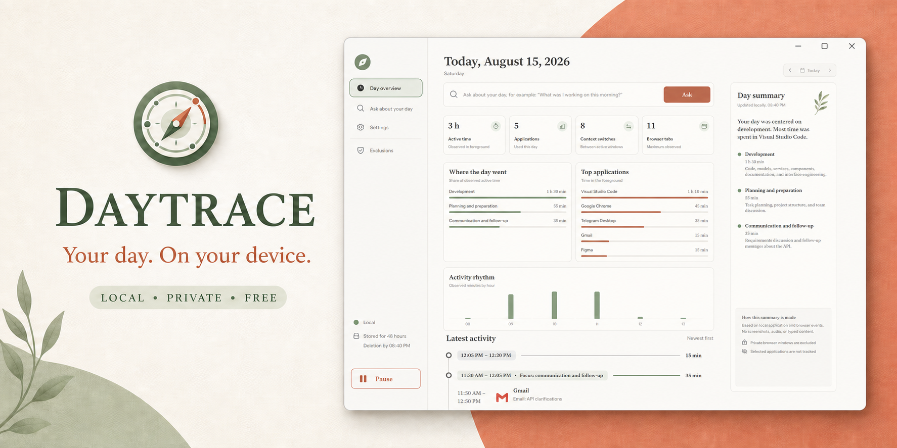

## Why Daytrace exists

The useful question is simple: **“What was I working on this morning?”** The answer is usually scattered across editors, browser tabs, documents, chats, and window switches.

OpenAI's announcement of Computer History validated this new category of desktop software. Its initial rollout was described as macOS-only and limited to Pro, Business, and Enterprise plans. Daytrace is an independent cross-platform alternative for people who want the utility without a subscription or a hosted activity history.

Daytrace requires no account and no API key. Events are captured, filtered, grouped, queried, and deleted on your computer. Capture and analysis work offline. Network access is limited to explicit GitHub operations: verified update checks/downloads and optional separately downloaded local analysis assets. None of these requests contains activity data.

> Computer History availability and plan limits may change after the initial announcement. Daytrace is not affiliated with or endorsed by OpenAI.

## Install with the guided setup

1. Open the [latest release](https://github.com/CaspianG/daytrace/releases/latest).
2. Download `Daytrace-Setup-…-x64.exe`.
3. Double-click it. Choose English or Russian, the installation location, and whether to add a Desktop shortcut. The Start Menu shortcut is added automatically.

No administrator account, separate .NET installation, browser extension, cloud account, or API key is required.

The current public build is not code-signed yet, so Windows SmartScreen may show **Unknown publisher**. Check the SHA-256 value published in the release notes before running it.

The exact v0.5.6 Windows installer has a public [VirusTotal report](https://www.virustotal.com/gui/file/56d1da401a82580e7e3f120fdc0e862b1fb289d8b1ce756b251fb87438b6793a?nocache=1): **0 of 65 engines flagged it** when the scan completed on August 24, 2026. Its SHA-256 is `56d1da401a82580e7e3f120fdc0e862b1fb289d8b1ce756b251fb87438b6793a`. This point-in-time result applies only when your downloaded file has exactly that hash; it is additional multi-engine evidence, not a substitute for `SHA256SUMS.txt`, source review, or future rescans.

Prefer a portable build? Download `Daytrace-Portable-…-x64.zip`, extract it, and run `Daytrace.exe`.

On macOS 12 or newer, first read the [macOS installation guide](docs/MACOS_INSTALL.md), then download the universal `Daytrace-…-macOS-universal.dmg`. The release page and mounted DMG both contain the same warning and instructions. Drag Daytrace to Applications, then use **Control-click/right-click → Open** for the first launch. If it is still blocked, use **System Settings → Privacy & Security → Open Anyway**. This Gatekeeper message is expected because the project does not currently have the paid Apple Developer ID certificate required for signing and notarization; it is not a malware detection result. Do not disable Gatekeeper globally.

After the app opens, Daytrace separately explains why Accessibility access is needed and registers the exact **Daytrace Collector** helper that reads active-window metadata. In Accessibility, enable **Daytrace Collector** — an old Daytrace or Daytrace 2 switch belongs to the UI app and does not authorize the collector. Daytrace verifies the grant by launching that same helper and starts tracking without a normal restart. The permission dialog is dismissible and can never lock access to settings or existing local history. Keep one installed `/Applications/Daytrace.app`; the built-in updater repairs numbered duplicates automatically. Verify the DMG against the release's `SHA256SUMS.txt` before opening it.

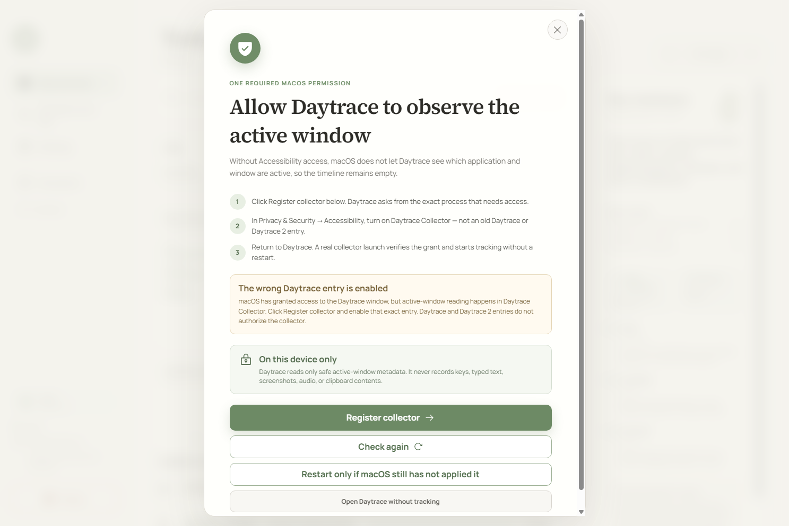

Minimizing or closing the window releases the heavy renderer while the lightweight native tracker continues from the system tray. Double-click the tray icon or launch Daytrace again to reopen the same instance.

Installed builds check for a stable update shortly after launch and every six hours while online. You can also use **Settings → Updates → Check for updates**. A compact bottom-left status shows checking, download percentage, verification, installation, restart, or an actionable error without opening Settings. On Windows, Daytrace verifies the installer, prepares the exact packaged payload without changing the current installation, then replaces it transactionally and reopens the same path. On macOS, Daytrace verifies the universal DMG, checks the embedded version, replaces the installed app, removes a numbered duplicate, and reopens the canonical copy automatically. The previous version remains recoverable until the replacement has rendered and shown a real window; a startup failure or missing readiness signal automatically restores and reopens the previous copy. Finder or the verified Windows installer is shown only when the platform does not allow the automatic path. Users upgrading from macOS v0.5.3 or older need the documented manual DMG replacement once because those installed versions do not yet contain the automatic updater.

### v0.5.6 crash-safe Windows updates

Windows updates now use the same outcome-based safety rule as macOS: starting a process is not treated as success. The SHA-256-verified Setup is first listed and extracted into an isolated sibling staging directory with path, size, reparse-point, payload, disk-space, and exact product-version checks. Daytrace closes only after the helper confirms that this preflight succeeded. The old installation is then renamed to a unique backup, the staged application takes its original path, and the new process must show a non-empty renderer, reach the preload/IPC/local-state bridge, return a one-time 256-bit readiness token, and remain alive before the backup is removed. A failed extraction, locked folder, startup crash, missing signal, or immediate exit keeps or restores the previous installation and reopens it. The installed uninstaller and shortcuts remain valid because the application path is preserved. If Windows cannot use the transactional path safely, the already verified Setup opens for manual confirmation and the existing app stays available.

### v0.5.5 reliability and security audit

The v0.5.5 release also closes several less-visible failure modes found during a full pre-release audit. Remote navigation cannot inherit the local IPC bridge, every IPC request must come from the exact Daytrace renderer, and the renderer has a restrictive Content Security Policy. macOS no longer records Daytrace's own window. Collector restarts cannot create duplicate trackers, generic browser windows stop time from leaking into an older tab title, malformed deletion requests fail closed, and ordinary questions load only the requested time range instead of scanning a long archive. Sensitive local files use owner-only permissions on macOS. CI now includes CodeQL, Dependabot configuration, pinned action revisions, and least-privilege release permissions.

## What you get

- **A complete day overview** with active time, applications, context switches, browser-tab maximum, focus distribution, top applications, and an interactive hourly rhythm chart with per-hour application and purpose details.
- **A newest-first timeline** grouped into focus sessions instead of a raw event dump, with smooth day navigation, the real selected date in the header, and an in-style calendar that marks days containing saved activity.
- **Explicit away-time boundaries**: five minutes without system input closes active tracking, returning to the same window starts a new interval, and gaps between sessions appear as localized Break entries.
- **Local questions across the retained calendar**, including exact dates, morning/afternoon/evening, relative ranges, and comparisons such as “Compare this week with last week.”
- **A real selected-day brief** with main contexts, likely completed items, open loops, long interruptions, and returns after a break — derived from observed local activity rather than invented task text.
- **Richer application context** from native Windows and macOS accessibility signals: active Chrome tab-title changes, numeric tab count, Telegram active-window/chat-title changes, and idle-aware reading time.
- **Private-window filtering** for Chrome Incognito, Edge InPrivate, Safari Private Browsing, and other common private-title conventions before disk writes. The optional browser companion supplies an explicit private flag and rejects it again at the local host boundary.
- **Application exclusions** with password managers excluded by default.
- **Configurable local retention**: 48 hours by default, or 7, 30, 90, or 365 days, with precise automatic pruning. Older days load only when selected, so a long archive does not become continuous background analysis.
- **Pause, session deletion, and delete-all controls** inside the app.
- **Local workflow detection** that can export a reviewable `SKILL.md` draft from repeated application sequences.
- **Complete English and Russian localization** for the interface, timeline labels, local answers, tray menu, installer, and exported skills.
- **System, Light, and Dark appearance modes** stored locally, with a native title-bar match, a quick sidebar switch, a complete Settings selector, and a reduced-motion-safe animated transition across every application surface.
- **First-run language choice** with an instant language switch available later in Settings.
- **Guided macOS permission setup** with the native Accessibility prompt, a direct System Settings link, and automatic detection when access is granted.
- **Launch at login** on Windows and macOS, starting quietly in the tray/menu bar.
- **Built-in verified updates** with automatic online checks, a manual Settings action, download progress, and a bottom-left action only when a newer stable release exists.
- **Fine-grained collection controls** for window titles, anonymous active-second samples, browser-tab counts, and private-window filtering.
- **Fact and inference shown separately**: the observed app/title/domain stays factual, while purpose is explicitly marked as an estimate. Telegram can be work or personal; a browser can be work, learning, entertainment, or genuinely ambiguous.
- **Visible confidence and evidence** for every inferred purpose, plus a low-confidence review journal. Ambiguous contexts remain **Ambiguous purpose** instead of silently becoming Personal.
- **A calm review reminder when ambiguity becomes a backlog**: Daytrace groups repeats into unique contexts and offers Review now, Improve with local model, or Remind me in 7 days after 5 unique contexts, 12 occurrences, or 45 minutes of uncertain activity.
- **Adaptive local purpose analysis** for popular video, streaming, social, shopping, learning, developer, office, creative, and communication contexts in English and Russian.
- **Scoped corrections**: changing a native application affects only that application; changing a browser page or chat affects only that exact app/title context and never recolors neighboring activities.
- **Broader visible-context understanding** for popular games, packaged game executables, technical work, debugging, installation, infrastructure, searches, comparisons, and reference pages in English and Russian.
- **Preview and Undo for corrections**: before a rule is applied, Daytrace shows the exact activity count, duration, days, and sample changes it will affect. The previous rule set remains locally recoverable.
- **Three local analysis modes**: Built-in uses no downloaded model; Signal pack 1.1 is a transparent SHA-256-verified RU/EN word-and-phrase weight file of about 6 KB; Semantic model 1.0 is an optional ~48 MB RU+EN sentence-encoder bundle that compares meaning instead of only exact keywords. The selected optional engine runs in a bounded, short-lived worker after five minutes of system idle on external power or on demand. Semantic inference uses one CPU thread, loads only the language needed for the current batch, and unloads each language worker before starting the next. It is not a chat or generative LLM, and Daytrace remains fully usable without it.
- **An honest side-by-side quality check** on the first-run screen and in Settings. Every mode shows decision precision and coverage from the same versioned RU/EN set. A separate local pass reports how much of this device's retained history each installed mode can classify and compares pre-correction predictions only with the contexts the user explicitly corrected. Titles never enter the aggregate quality cache, and a small personal sample is labelled as preliminary instead of being presented as reliable accuracy.
- **First-run setup that truly runs once per local profile** explains privacy and lets a new user explicitly choose Built-in, Signal pack, or Semantic model. Updates never reopen it. A separate five-step animated guide runs over the real interface once after setup and stays replayable from the sidebar or Settings without changing any preference.
- **Optional Chromium browser companion** for Chrome, Edge, Brave, and Vivaldi. Native messaging adds only the focused browser window's active tab title, domain, safe path, and explicit private flag; query strings, fragments, credentials, page content, background windows/tabs, and private contexts are discarded.
- **JSON and CSV export**, plus streaming encrypted backup/restore using scrypt and AES-256-GCM. Restore is transactional, and the passphrase is never stored.
- **Built-in self-diagnostics** for storage, collector health, title and idle signals, private filtering, Accessibility, autostart, browser companion, and the selected optional analysis engine.

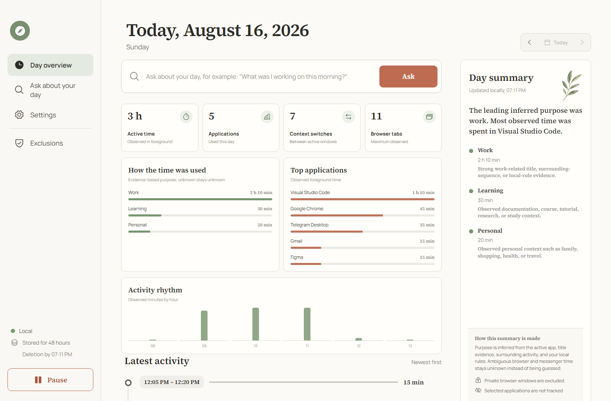

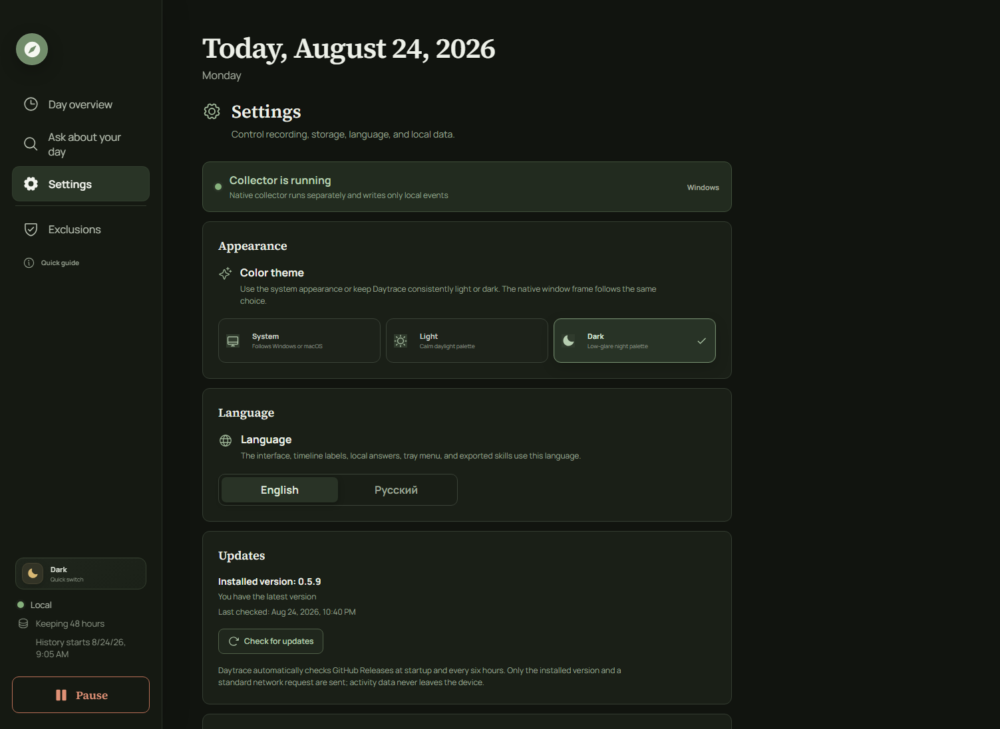

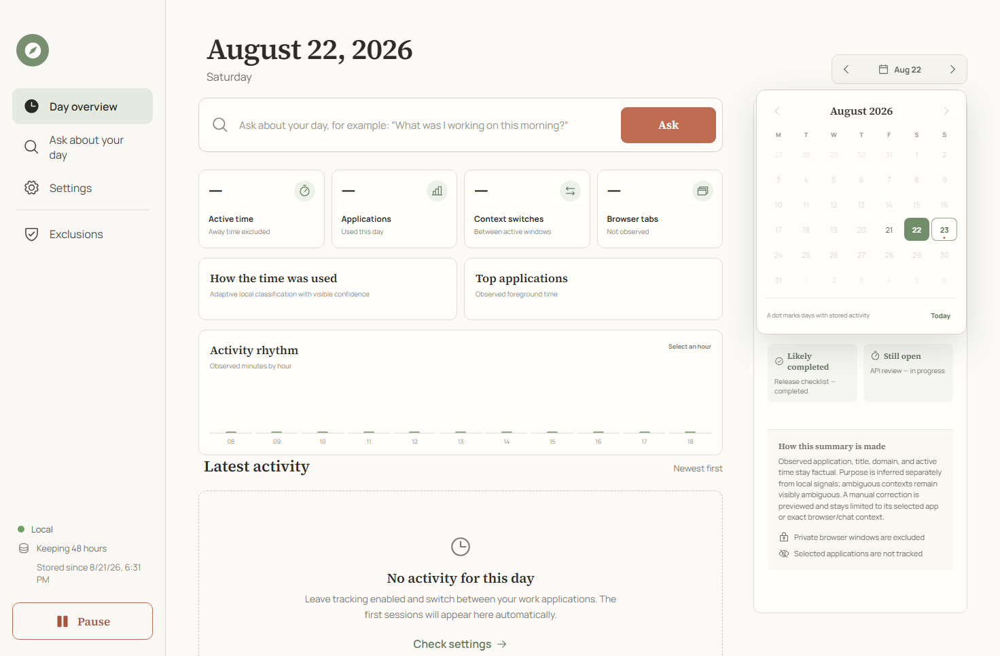

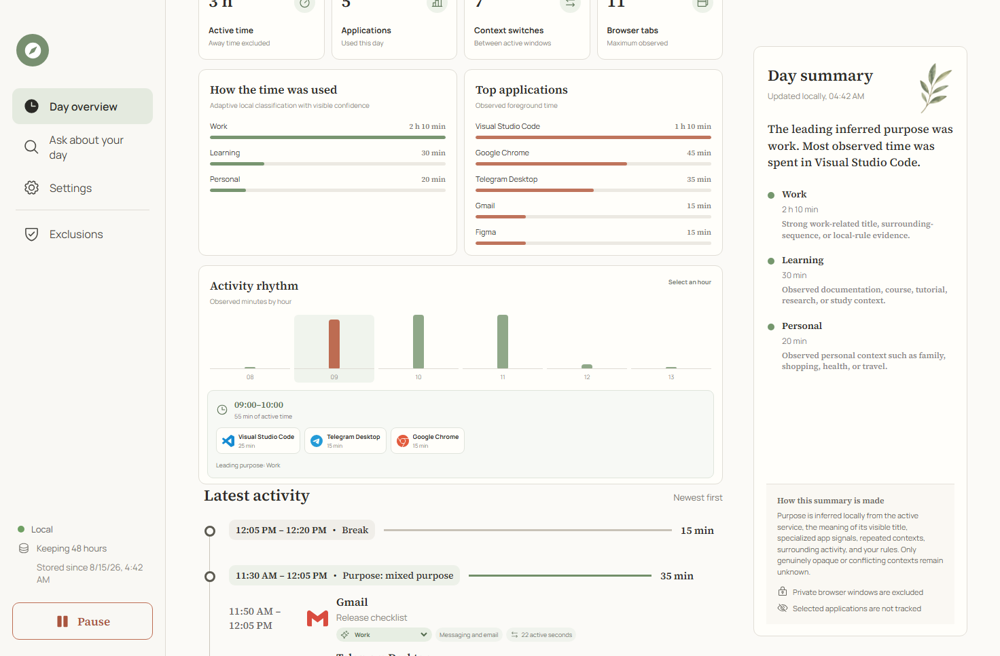


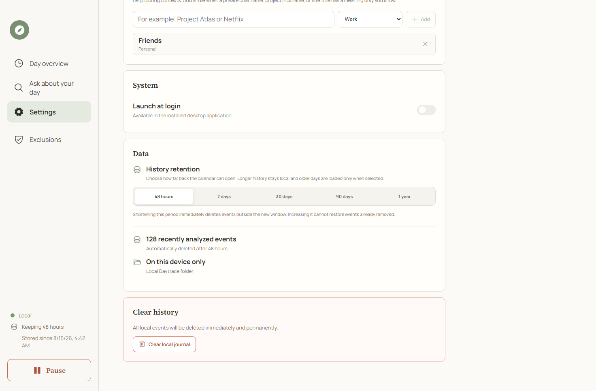

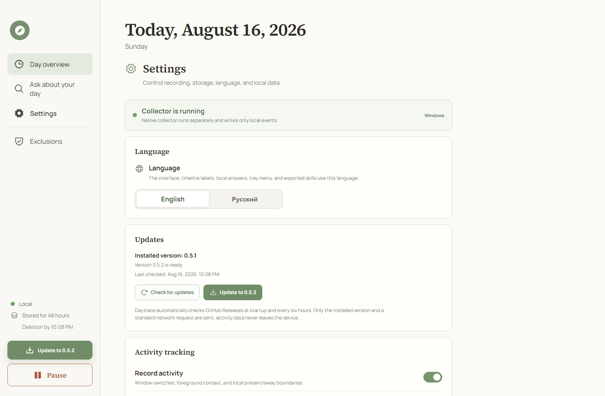

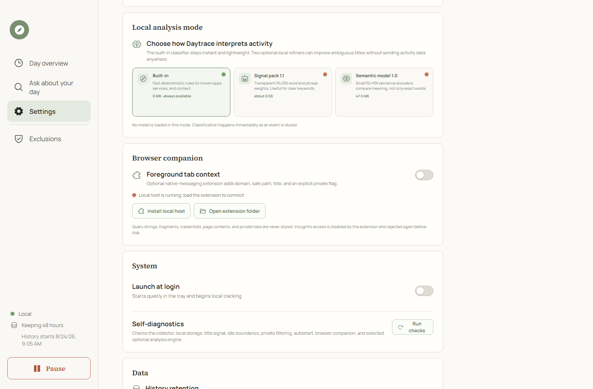

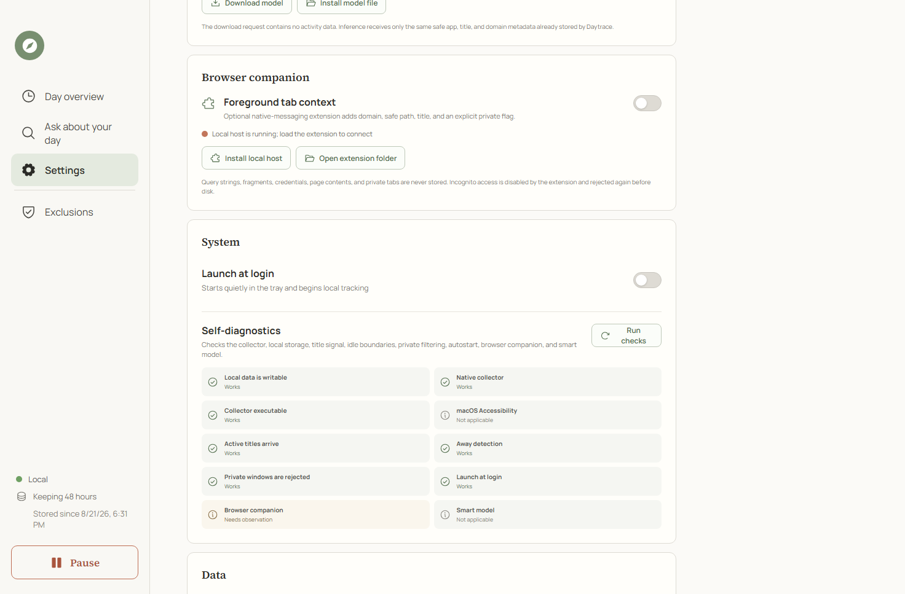

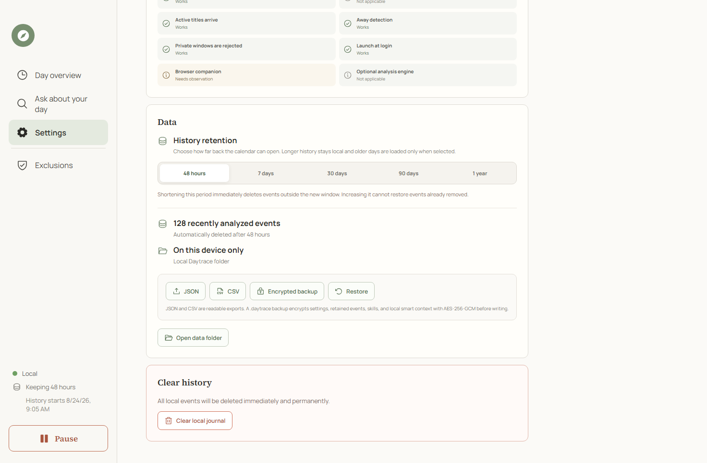

## One short setup, one in-app guide, then Daytrace learns locally

Version 0.5.9 separates mandatory setup from product help. Setup opens only for a local profile that has never completed it; changing the app version can no longer reopen the screen. A new profile then receives one short animated guide over the actual overview, question bar, purpose correction, model settings, and local-status controls. Opening or finishing the guide immediately records that it was shown, so a crash or forced shutdown cannot create a startup loop. The same guide remains available on demand from the sidebar and Settings without resetting setup.

Built-in remains the selected default for zero download and minimum load. Semantic is the quality-oriented option because it covers more of the shared control set, but it is still optional, checksum-verified, one-threaded, idle-only for automatic passes, and unloaded after a bounded batch. Two larger multilingual candidates were evaluated reproducibly and rejected because they were roughly 2.7× larger while producing materially lower held-out decision precision. Daytrace does not add a heavier model merely to advertise one.

When enough low-confidence activity accumulates, Daytrace shows one in-app reminder instead of repeatedly interrupting the user. Repeated appearances of the same application, page, or chat are grouped into one review item. A confirmed correction is stored as a local rule and reused for that same scope in later activity; the preview and Undo remain available before any timeline is changed.

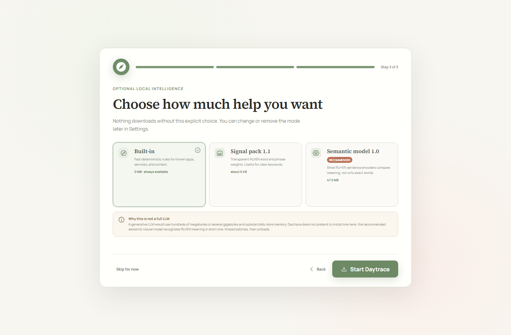

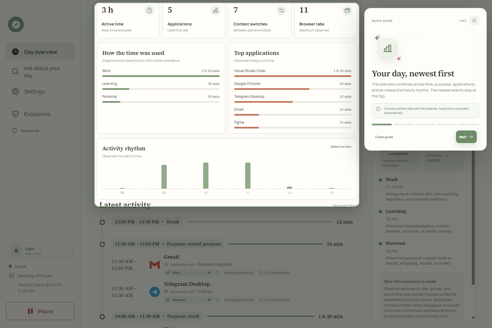

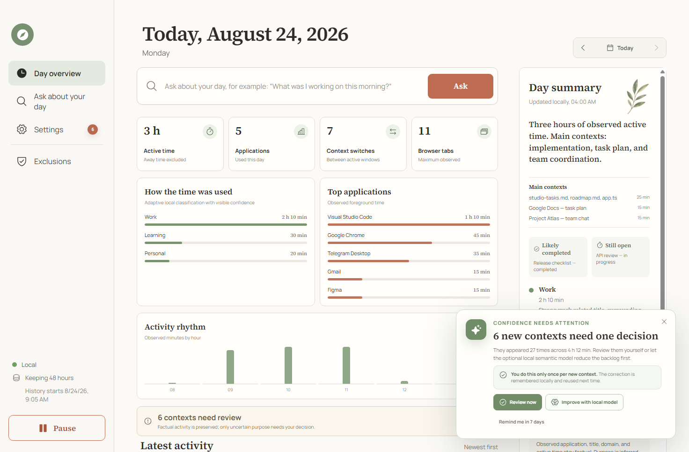

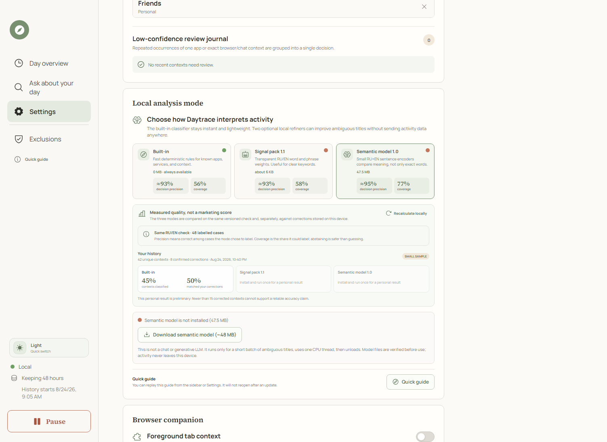

| Mode | Decision precision | Coverage | Download / trade-off |
| --- | ---: | ---: | --- |
| Built-in | about 93% (25/27) | 56% (27/48) | 0 MB, instant and deterministic |
| Signal pack 1.1 | about 93% (26/28) | 58% (28/48) | about 6 KB, transparent phrase weights |
| Semantic model 1.0 | about 95% (35/37) | 77% (37/48) | about 48 MB, short one-thread batches |

These figures use the same 48 labelable RU/EN cases. “Decision precision” excludes abstentions; “coverage” shows how often the mode had enough evidence to answer. They are not universal personal-history accuracy. Settings therefore shows a second, device-local comparison: coverage across retained unique contexts and agreement only against explicit user corrections, including the exact sample size and a small-sample warning below 15 corrected contexts. An installed optional mode is not given a copied or estimated personal score before its first real local pass; the UI asks the user to run it once instead.

The same interface is also available in [Russian](README_RU.md), including localized summaries and system-tray controls.

## Purpose, not application stereotypes

Daytrace never treats “messenger” as a synonym for work or “browser” as a synonym for distraction. Every foreground interval has two independent labels:

| Layer | Example | What it answers |
| --- | --- | --- |
| Activity type | Messaging, browser, development, audio | What kind of application was active? |
| Inferred purpose | Work, learning, personal, entertainment, ambiguous | Why was that context most likely being used? |

Purpose is inferred in layers: a recognized foreground service, the meaning of the visible active title, specialized application category, repeated title context inside the configured local journal, nearby activity, the dominant purpose of a coherent work block, and user-authored local rules. Specific semantic evidence overrides broad service priors: a YouTube lecture is learning, YouTube Studio is work, and ordinary YouTube viewing is entertainment. Conflicting or genuinely opaque evidence remains **Ambiguous purpose**, with a low-confidence reason and the exact evidence visible in the timeline and review journal. Daytrace never maps ambiguity to Personal. Use the purpose picker beside any item to propose a scoped rule; a preview shows its impact before the timeline, charts, answers, and workflow suggestions are recalculated, and the change can be undone.

This is deliberately not message-content analysis. Daytrace can classify an active Telegram chat named “Project Atlas — client meeting” from its visible title and can reuse the same locally observed context later, but it cannot know what an opaque chat name means without surrounding evidence or your correction. The same boundary applies to browser pages, documents, editors, and every other application.

Classifier changes are guarded by versioned synthetic RU/EN sets covering browsers, messengers, IDEs, games, video, documents, meetings, and learning. The shared comparison above is recomputed from source by `npm run model:verify:semantic`; CI fails if its checked-in counts drift. On its held-out part, Built-in and Signal pack each currently give about 91% decision precision and 72% coverage, while Semantic gives about 91% precision and 69% coverage. Real-history metadata can be much shorter and noisier, so weak titles, chat handles, price tickers, generic mail/search windows, and truncated UI text are rejected before inference. The per-device checker streams retained JSONL in a background worker and persists only counts and ratios. These are regression diagnostics, not a promise that every real-world title can be understood.

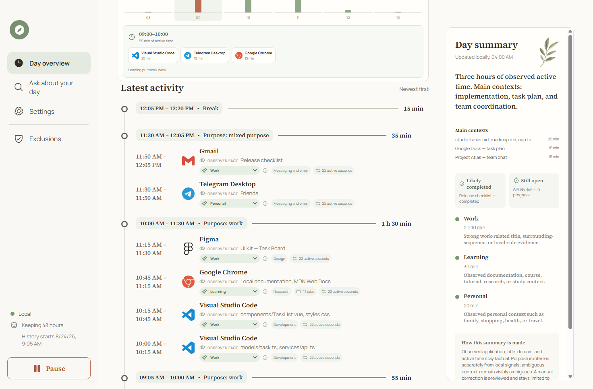

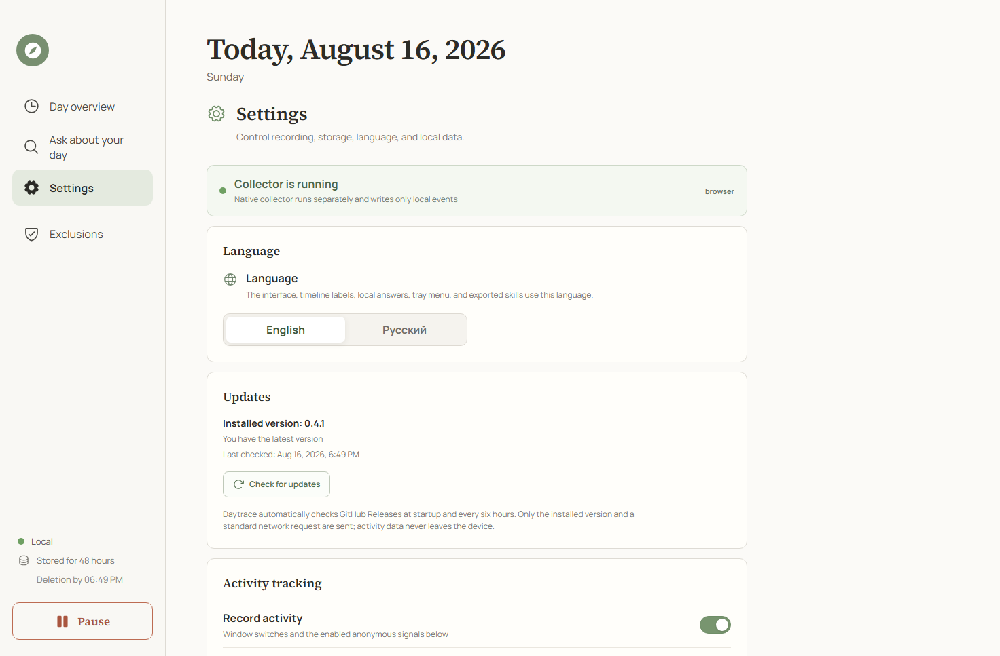

## Privacy model

Daytrace is intentionally less invasive than screenshot-based activity recorders.

| Recorded locally | Never recorded |
| --- | --- |
| Active application name | Screenshots or screen video |
| Active window title | Audio or microphone input |
| Numeric count of visible browser tabs | Full URLs, query strings, fragments, or titles of background tabs |
| Optional foreground domain and safe path | Page contents, cookies, credentials, or form values |
| Window-switch timestamp | Clipboard contents |
| Anonymous active-second samples on Windows | Mouse coordinates |
| Aggregate keypress/click counts on macOS | Key identities or typed text |
| Session duration | Form values or passwords |

Window titles can contain document names, page titles, or conversation names. They stay local, but you should exclude sensitive applications. Base private-browser detection uses title conventions because operating-system accessibility APIs do not expose one universal private-mode signal. The optional Chromium companion is declared with `incognito: not_allowed`, rejects private tabs in the extension, and the native host rejects them again. Exclusions remain the strongest control for a sensitive application.

Daytrace has no telemetry or cloud-analysis endpoint. The updater requests the official GitHub Releases endpoint with only the installed version and verifies the selected artifact against `SHA256SUMS.txt`. If you explicitly download an optional analysis asset, Daytrace fetches version-matched release files and verifies their exact size and app-embedded SHA-256 before use. No journal events, titles, domains, questions, rules, or settings are included in these requests. The semantic worker is configured for local files only and the renderer CSP blocks external connections. Browser companion traffic stays on a per-user local pipe/socket protected by a random token.

Default data location:

```text
%APPDATA%\daytrace-local\daytrace-data\
├── events\YYYY-MM-DD-HH.jsonl
├── settings.json
├── smart-contexts.json
├── models\                  # only after an optional model is selected
└── skills\<workflow>\SKILL.md
```

The Russian semantic encoder is from the MIT-licensed [`rubert-tiny-sts`](https://huggingface.co/VadimHursevich/rubert-tiny-sts-onnx) family and is dynamically quantized to int8. The English encoder is the Apache-2.0-licensed [`paraphrase-MiniLM-L3-v2`](https://huggingface.co/sentence-transformers/paraphrase-MiniLM-L3-v2) int8 export. Exact source revisions, checksums, conversion instructions, and license texts are stored beside the model assets in [`models/semantic`](models/semantic) and [`models/semantic-en`](models/semantic-en).

Uninstalling the application preserves this folder so history is not destroyed unexpectedly. Use **Delete all data** inside Daytrace if you want to erase the journal first.

## How it works

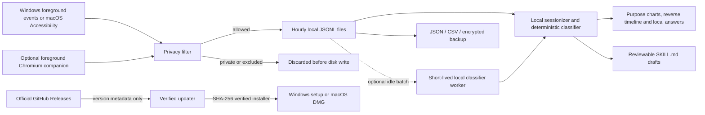
```mermaid
flowchart LR
    A["Windows foreground events or macOS Accessibility"] --> B["Privacy filter"]
    H["Optional foreground Chromium companion"] --> B
    B -->|"allowed"| C["Hourly local JSONL files"]
    B -->|"private or excluded"| X["Discarded before disk write"]
    C --> D["Local sessionizer and deterministic classifier"]
    C -.->|"optional idle batch"| M["Short-lived local classifier worker"]
    M --> D
    D --> E["Purpose charts, reverse timeline and local answers"]
    D --> F["Reviewable SKILL.md drafts"]
    C --> K["JSON / CSV / encrypted backup"]
    U["Official GitHub Releases"] -->|"version metadata only"| V["Verified updater"]
    V -->|"SHA-256 verified installer"| G["Windows setup or macOS DMG"]
```

The native tracker emits foreground-window changes, samples only the foreground title every few seconds, writes idle-aware heartbeats, checks a numeric browser-tab count once per minute on Windows, and records only anonymous activity aggregates. Both platforms detect five minutes without system input and emit local idle/resume boundaries. The Windows collector uses no global keyboard or mouse hook. Electron's local main process applies privacy rules, stores hourly JSONL segments, and exposes state to the sandboxed renderer over a sender-validated IPC bridge with navigation locked to the packaged local interface. It never reads message bodies, typed text, pointer coordinates, or background-tab titles. When enabled, the browser companion strips credentials, query strings, and fragments before sending the foreground domain and safe path over local native messaging.

Durations are observed foreground intervals, not the time an application merely remained open. Leaving a browser tab open overnight cannot reconnect the previous evening to the next morning: an explicit idle event closes it, and a six-minute signal-gap guard also protects legacy journals, sleep/wake cycles, and collector restarts. Minute heartbeats still preserve passive reading or video viewing while the computer remains in use. Repeated title events are collapsed, sub-second fragments and system windows are ignored, and overview totals are calculated per activity rather than inherited from the first application in a work block.

Local answers do not use an LLM. A deterministic on-device parser recognizes exact and relative dates, comparison periods, time ranges, applications, purposes, and the question type (summary, duration, latest activity, tabs, or context switches), then calculates the response from local sessions. The optional signal or semantic engine can improve the purpose labels used by those answers, but neither generates prose, receives a raw journal, stays resident, or makes network inference calls. The interpreted query is shown above each answer so mistakes are visible.

## System load

Daytrace uses native foreground events and coarse samples instead of screenshots or continuous screen polling. In the current v0.5.9 Windows verification run, the renderer-free Electron background runtime averaged **0.032% CPU** across sampled Electron processes over 12 seconds; the main process measured **0.392% CPU** over the same interval. It peaked at **125.6 MiB private memory / 193.9 MiB working set**, grew by only **0.1 MiB** across the sample, and kept three Electron service processes. The final native Windows collector was measured separately over 20.10 seconds: it consumed no measurable CPU tick in that sample, peaked at **28.6 MiB working set / 7.0 MiB private memory**, and stayed at 13 threads. These are development-runtime measurements rather than a hardware-independent guarantee. The automated release gate rejects an Electron background average above **5% CPU** or **180 MiB private memory**. On the retained local history used for this release check, a cold 48-hour dashboard state took about **499 ms**, a cached selected day about **0.01 ms**, and a state refresh after a new event about **220 ms**; no titles left the device. The updater adds one small metadata request after startup and then at most once every six hours while online; it does not continuously poll. Equivalent physical-Mac measurements are still being collected and are not inferred from the Windows result.

Stability is tested separately from ordinary unit tests. The desktop smoke deliberately terminates the Windows collector and force-crashes the Electron renderer, then requires Daytrace to restore both. Runtime recovery uses bounded exponential backoff, a ten-second collector readiness watchdog, and a three-attempt renderer ceiling so a broken component cannot become a tight restart loop. Suspending or locking the computer stops the collector; resume or unlock starts a fresh collector and restores the operating-system hooks. On macOS, denied Accessibility checks back off from two seconds to thirty seconds instead of spawning a helper continuously, foreground Accessibility reads stop while the user is idle, and a disabled event tap is re-enabled automatically. The optional browser companion has the same bounded recovery path.

The browser companion is event-driven and has no polling loop. Its native bridge is started only for one foreground-context delivery and exits immediately, so enabling the extension does not leave a second Electron process resident. The zero-download built-in classifier is the default. An automatic optional signal or semantic pass waits for at least five minutes of idle time, external power, and new contexts, processes a bounded batch, and terminates its worker afterward; manual analysis remains available at any time. In the current Windows Electron/WASM smoke test, a bilingual semantic pass reviewed two ambiguous contexts in **2.19 s**: the complete background process tree rose from **149.2 MiB to a transient 561.1 MiB of private memory**, then the hidden analysis host was destroyed. This is a deliberately conservative worst-case RU+EN test, not a continuous background footprint; a one-language pass can be smaller, and results vary by machine. Historical days and one-year retention are loaded lazily instead of being re-analyzed continuously.

The v0.5.5 long-history path was also measured separately with a synthetic one-year archive of **8,760 hourly files** on the Windows verification machine. Opening the store took **63.3 ms**, building the bounded recent state took **106.2 ms**, and answering a today-only question took **28.7 ms** while reading just **48 recent events**. This is a storage/analysis benchmark, not a claim about total launch time; it demonstrates that selecting one-year retention does not turn the full archive into continuous background work.

The Windows native collector remains self-contained, so users do not install .NET separately. The lean v0.5.5 publish keeps ReadyToRun startup optimization while removing debug payloads and unused framework localizations, reducing its verified output from **160.1 MiB / 464 files to 144.5 MiB / 242 files**.

## Current limitations

- Windows x64 is tested on Windows 10/11. The macOS universal build targets macOS 12+ and its packaging is checked by CI; broader real-device coverage is still needed.
- Local Q&A is deterministic and rule-based — the optional signal and semantic refiners are not conversational LLMs.
- Base tracking analyzes only the foreground app and visible active-window title. The optional companion adds foreground domain and safe path for Chrome, Edge, Brave, and Vivaldi; it does not read page contents or background tabs. Firefox and Safari do not use this companion.
- Base private-window detection depends on browser title conventions and cannot be guaranteed for every browser/version. Companion-provided private flags are rejected, but exclusions remain the safest choice for sensitive apps.
- Raw local journals rely on operating-system account permissions and are not separately encrypted at rest; use BitLocker or FileVault when device-at-rest protection matters. Exported `.daytrace` backups are encrypted with a user passphrase.
- Chromium security does not allow Daytrace to silently install an unpacked extension. The app registers the local native host and opens the exact extension folder; the user must load it once in the browser's extension page. Incognito permission is intentionally unavailable.
- A transactional Windows update temporarily needs enough free space for one staged application copy (at least 512 MiB; normally the installed size plus a 128 MiB margin). If the built-in Windows archive helper is unavailable, the install folder is protected, or this check fails, Daytrace leaves the current installation untouched and opens the verified Setup for manual confirmation.
- The installer is not code-signed yet.

These boundaries are documented because privacy software should be explicit about what it can and cannot prove.

## Build from source

Requirements: Node.js 22+ and npm. Windows tracker builds also need the .NET 8 SDK; macOS tracker builds need Xcode Command Line Tools.

```powershell
git clone https://github.com/CaspianG/daytrace.git
cd daytrace
npm ci
npm run dev:desktop
```

Optional foreground browser context is installed from **Settings → Browser companion**. Daytrace registers the per-user native host, then opens the bundled extension folder. In Chrome/Edge/Brave/Vivaldi, enable Developer mode, choose **Load unpacked**, and select that folder. Leave Incognito access disabled; the manifest also forbids it.

Run verification and produce both installer and portable artifacts:

```powershell
npm test
npm run test:accuracy
npm run test:desktop
npm run test:stability
npm run test:performance
npm run test:sites
npm run dist
```

Use `npm run dist:win` on Windows or `npm run dist:mac` on macOS.
Use `npm run screenshots` to regenerate every English and Russian README image. `npm run clean:check` previews the cleanup; `npm run clean` removes only allowlisted generated outputs (`dist`, `release`, coverage/test results, Vite cache, and native build folders) after validating that every target remains inside the repository.

Artifacts are written to `release/`:

- `Daytrace-Setup-<version>-x64.exe`
- `Daytrace-Portable-<version>-x64.zip`
- `Daytrace-<version>-macOS-universal.dmg`
- `Daytrace-<version>-macOS-universal.zip`

## Project status

Daytrace is an early public release. The privacy boundary, retention behavior, bilingual interface, installer cycle, and application launch are tested; broader browser coverage still needs community testing.

Issues and focused pull requests are welcome. Read [CONTRIBUTING.md](CONTRIBUTING.md) before changing capture or privacy behavior.

## License

[MIT](LICENSE) © Daytrace contributors.
