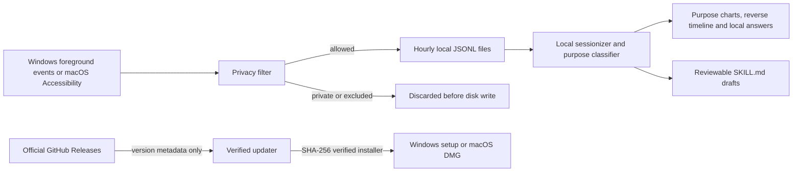

<p align="center">
  
</p>

<h1 align="center">Daytrace</h1>

<p align="center"><strong>Your day. On your device.</strong></p>

<p align="center">
  A free, open-source Windows and macOS app that turns local application activity into a useful workday timeline — without screenshots, audio, accounts, APIs, or cloud storage.
</p>

<p align="center">
  <a href="https://github.com/CaspianG/daytrace/releases/latest"><strong>Download for Windows or macOS</strong></a>
  · <a href="README_RU.md">Русская версия</a>
  · <a href="SECURITY.md">Security</a>
</p>

<p align="center"><strong>Current release: v0.5.1</strong> — Windows and macOS artifacts are built from the same tag and published together.</p>

<p align="center">
  
  
  
  
  
</p>


## Why Daytrace exists

The useful question is simple: **“What was I working on this morning?”** The answer is usually scattered across editors, browser tabs, documents, chats, and window switches.

OpenAI's announcement of Computer History validated this new category of desktop software. Its initial rollout was described as macOS-only and limited to Pro, Business, and Enterprise plans. Daytrace is an independent cross-platform alternative for people who want the utility without a subscription or a hosted activity history.

Daytrace requires no account and no API key. Events are captured, filtered, grouped, queried, and deleted on your computer. The only built-in network feature is the updater: it checks the official GitHub Releases endpoint using the installed version and never includes activity data.

> Computer History availability and plan limits may change after the initial announcement. Daytrace is not affiliated with or endorsed by OpenAI.

## Install with the guided setup

1. Open the [latest release](https://github.com/CaspianG/daytrace/releases/latest).
2. Download `Daytrace-Setup-…-x64.exe`.
3. Double-click it. Choose English or Russian, the installation location, and whether to add a Desktop shortcut. The Start Menu shortcut is added automatically.

No administrator account, separate .NET installation, browser extension, cloud account, or API key is required.

The current public build is not code-signed yet, so Windows SmartScreen may show **Unknown publisher**. Check the SHA-256 value published in the release notes before running it.

Prefer a portable build? Download `Daytrace-Portable-…-x64.zip`, extract it, and run `Daytrace.exe`.

On macOS 12 or newer, download the universal `Daytrace-…-macOS-universal.dmg` and drag Daytrace to Applications. On first launch, Daytrace explains why Accessibility access is needed, opens the exact Privacy & Security pane, and automatically starts tracking when you return after enabling Daytrace. You can continue without the permission, but the timeline will remain empty until it is granted.

The current v0.5.1 macOS build is not notarized, so Gatekeeper may require **Open** from Finder's context menu. The release pipeline is now prepared to refuse future unsigned or unnotarized macOS artifacts; removing this warning from a public build requires the repository owner to configure an Apple Developer ID certificate and notarization key as described in [the macOS signing guide](docs/MACOS_SIGNING.md).

Minimizing or closing the window releases the heavy renderer while the lightweight native tracker continues from the system tray. Double-click the tray icon or launch Daytrace again to reopen the same instance.

Installed builds check for a stable update shortly after launch and every six hours while online. You can also use **Settings → Updates → Check for updates**. When a newer release exists, an **Update** button appears at the bottom left. Windows verifies and starts the installer automatically; macOS verifies and opens the universal DMG for the standard user-confirmed installation flow.

## What you get

- **A complete day overview** with active time, applications, context switches, browser-tab maximum, focus distribution, top applications, and an hourly rhythm chart.
- **A newest-first timeline** grouped into focus sessions instead of a raw event dump, with previous-day navigation inside the retention window.
- **Explicit away-time boundaries**: five minutes without system input closes active tracking, returning to the same window starts a new interval, and gaps between sessions appear as localized Break entries.
- **Local questions about your day**, including morning, afternoon, evening, today, yesterday, and purpose-specific questions such as “How long did I study?”
- **A selected-day summary** showing work, learning, personal, entertainment, and honestly unknown time separately.
- **Richer application context** from Windows event and accessibility APIs: active Chrome tab-title changes, numeric tab count, Telegram active-window/chat-title changes, and idle-aware reading time.
- **Private-window filtering** for common Incognito, InPrivate, and Private Browsing titles before disk writes.
- **Application exclusions** with password managers excluded by default.
- **48-hour retention** with precise automatic pruning of older event lines.
- **Pause, session deletion, and delete-all controls** inside the app.
- **Local workflow detection** that can export a reviewable `SKILL.md` draft from repeated application sequences.
- **Complete English and Russian localization** for the interface, timeline labels, local answers, tray menu, installer, and exported skills.
- **First-run language choice** with an instant language switch available later in Settings.
- **Guided macOS permission setup** with the native Accessibility prompt, a direct System Settings link, and automatic detection when access is granted.
- **Launch at login** on Windows and macOS, starting quietly in the tray/menu bar.
- **Built-in verified updates** with automatic online checks, a manual Settings action, download progress, and a bottom-left action only when a newer stable release exists.
- **Fine-grained collection controls** for window titles, anonymous active-second samples, browser-tab counts, and private-window filtering.
- **Two-layer classification** that keeps the application type separate from the inferred purpose. Telegram can be work or personal; a browser can be work, learning, entertainment, or unknown.
- **Adaptive local purpose analysis** for popular video, streaming, social, shopping, learning, developer, office, creative, and communication contexts, with confidence and the reason for every inference.
- **One-click local corrections** on timeline entries plus reusable substring rules for chats, page titles, projects, and keywords. Rules never leave the device.


The same interface is also available in [Russian](README_RU.md), including localized summaries and system-tray controls.

## Purpose, not application stereotypes

Daytrace never treats “messenger” as a synonym for work or “browser” as a synonym for distraction. Every foreground interval has two independent labels:

| Layer | Example | What it answers |
| --- | --- | --- |
| Activity type | Messaging, browser, development, audio | What kind of application was active? |
| Inferred purpose | Work, learning, personal, entertainment, unknown | Why was that context most likely being used? |

Purpose is inferred in layers: a recognized foreground service, the meaning of the visible active title, specialized application category, repeated title context inside the 48-hour journal, nearby activity, the dominant purpose of a coherent work block, and user-authored local rules. Specific semantic evidence overrides broad service priors: a YouTube lecture is learning, YouTube Studio is work, and ordinary YouTube viewing is entertainment. Conflicting or genuinely opaque evidence remains **Unknown purpose**, with a low-confidence reason visible in the timeline. Use the purpose picker beside any item to correct it; Daytrace stores a local rule for that chat, title, project, or keyword and recalculates the timeline, charts, answers, and workflow suggestions.

This is deliberately not message-content analysis. Daytrace can classify an active Telegram chat named “Project Atlas — client meeting” from its visible title and can reuse the same locally observed context later, but it cannot know what an opaque chat name means without surrounding evidence or your correction. The same boundary applies to browser pages, documents, editors, and every other application.


## Privacy model

Daytrace is intentionally less invasive than screenshot-based activity recorders.

| Recorded locally | Never recorded |
| --- | --- |
| Active application name | Screenshots or screen video |
| Active window title | Audio or microphone input |
| Numeric count of visible browser tabs | URLs or titles of background tabs |
| Window-switch timestamp | Clipboard contents |
| Anonymous active-second samples on Windows | Mouse coordinates |
| Aggregate keypress/click counts on macOS | Key identities or typed text |
| Session duration | Form values or passwords |

Window titles can contain document names, page titles, or conversation names. They stay local, but you should exclude sensitive applications. Private-browser detection is title-based because browsers do not expose one universal private-mode signal; treat exclusions as the stronger control.

The updater is the only built-in network path. It normally requests `api.github.com/repos/CaspianG/daytrace/releases/latest` with `Daytrace/<installed version>` in the user agent. If that unauthenticated endpoint is rate-limited, it falls back to the public Releases feed and `SHA256SUMS.txt`. No journal events, titles, questions, rules, or settings are transmitted. Daytrace accepts only the exact expected artifact from the official repository and verifies its published SHA-256 digest before opening it.

Default data location:

```text
%APPDATA%\daytrace-local\daytrace-data\
├── events\YYYY-MM-DD-HH.jsonl
├── settings.json
└── skills\<workflow>\SKILL.md
```

Uninstalling the application preserves this folder so history is not destroyed unexpectedly. Use **Delete all data** inside Daytrace if you want to erase the journal first.

## How it works



The native tracker emits foreground-window changes, samples only the foreground title every few seconds, writes idle-aware heartbeats, checks a numeric browser-tab count once per minute on Windows, and records only anonymous activity aggregates. Both platforms detect five minutes without system input and emit local idle/resume boundaries. The Windows collector uses no global keyboard or mouse hook. Electron's local main process applies privacy rules, stores hourly JSONL segments, and exposes state to the sandboxed renderer over a narrow IPC bridge. It never reads message bodies, typed text, URLs, pointer coordinates, or background-tab titles. There is no cloud backend; only release metadata and verified installer downloads use the network.

Durations are observed foreground intervals, not the time an application merely remained open. Leaving a browser tab open overnight cannot reconnect the previous evening to the next morning: an explicit idle event closes it, and a six-minute signal-gap guard also protects legacy journals, sleep/wake cycles, and collector restarts. Minute heartbeats still preserve passive reading or video viewing while the computer remains in use. Repeated title events are collapsed, sub-second fragments and system windows are ignored, and overview totals are calculated per activity rather than inherited from the first application in a work block.

Local answers do not use an LLM. A deterministic on-device parser recognizes the requested day/time range, application, purpose, and question type (summary, duration, latest activity, tabs, or context switches), then calculates the response from local sessions. Questions about work, learning, personal time, or entertainment include only activities supported by the classifier and local rules. The interpreted query is shown above each answer so mistakes are visible.

## System load

Daytrace uses native foreground events and coarse samples instead of screenshots or continuous screen polling. On the Windows verification machine, the packaged v0.4.0 background process measured **0.039% total CPU** over a 30-second sample and **199 MiB combined working memory** across Electron and the native collector with no renderer process. A clean packaged launch reached a validated non-empty window in **1.14 s**. The updater adds one small metadata request after startup and then at most once every six hours while online; it does not continuously poll. Measurements vary by hardware, antivirus, event volume, and operating system; macOS packaging is verified in CI, but equivalent physical-Mac load measurements are still being collected.

## Current limitations

- Windows x64 is tested on Windows 10/11. The macOS universal build targets macOS 12+ and its packaging is checked by CI; broader real-device coverage is still needed.
- Local Q&A is deterministic and heuristic — it is not a bundled language model.
- Daytrace analyzes only the foreground app and visible active-window title. It does not read message bodies, page contents, URLs, or background-tab titles, so an opaque chat or page can still require a local correction.
- Private-window detection depends on browser title conventions and cannot be guaranteed for every browser/version.
- The installer is not code-signed yet.

These boundaries are documented because privacy software should be explicit about what it can and cannot prove.

## Build from source

Requirements: Node.js 22+ and npm. Windows tracker builds also need the .NET 8 SDK; macOS tracker builds need Xcode Command Line Tools.

```powershell
git clone https://github.com/CaspianG/daytrace.git
cd daytrace
npm ci
npm run dev:desktop
```

Run verification and produce both installer and portable artifacts:

```powershell
npm test
npm run test:sites
npm run dist
```

Use `npm run dist:win` on Windows or `npm run dist:mac` on macOS.

Artifacts are written to `release/`:

- `Daytrace-Setup-<version>-x64.exe`
- `Daytrace-Portable-<version>-x64.zip`
- `Daytrace-<version>-macOS-universal.dmg`
- `Daytrace-<version>-macOS-universal.zip`

## Project status

Daytrace is an early public release. The privacy boundary, retention behavior, bilingual interface, installer cycle, and application launch are tested; broader browser coverage still needs community testing.

Issues and focused pull requests are welcome. Read [CONTRIBUTING.md](CONTRIBUTING.md) before changing capture or privacy behavior.

## License

[MIT](LICENSE) © Daytrace contributors.
