<p align="center">
  
</p>

<h1 align="center">Daytrace</h1>

<p align="center"><strong>Ваш день. На вашем устройстве.</strong></p>

<p align="center">
  Бесплатное приложение для Windows и macOS с открытым кодом: превращает локальную активность в понятную историю рабочего дня — без скриншотов, аудио, аккаунта, API и облачного хранения.
</p>

<p align="center">
  <a href="https://github.com/CaspianG/daytrace/releases/latest"><strong>Скачать для Windows</strong></a>
  · <a href="docs/MACOS_INSTALL_RU.md"><strong>Установить на macOS</strong></a>
  · <a href="README.md">English</a>
  · <a href="SECURITY.md">Безопасность</a>
</p>

<p align="center"><strong>Текущий релиз: v0.5.8</strong> — версии для Windows и macOS собираются из одного тега и публикуются одновременно.</p>

> **Важно перед первым запуском на macOS:** текущая версия для Mac бесплатна и полностью локальна, но не подписана и не нотарифицирована, потому что у проекта нет учётных данных Apple Developer ID. Поэтому Gatekeeper покажет предупреждение. Перед скачиванием откройте [безопасную инструкцию по установке на macOS](docs/MACOS_INSTALL_RU.md): она использует штатные пункты **«Открыть»** / **«Всё равно открыть»** и не отключает Gatekeeper.

<p align="center">
  
  
  
  
</p>

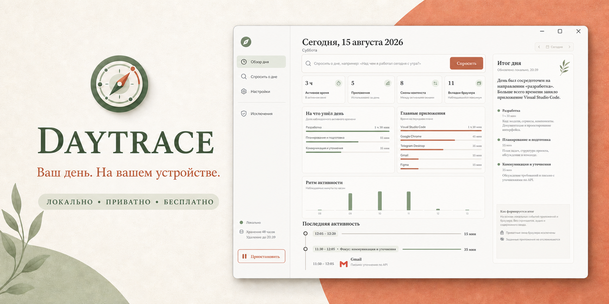

## Зачем нужен Daytrace

Вопрос простой: **«Над чем я работал сегодня с утра?»** Ответ обычно разбросан между редактором, вкладками браузера, документами, чатами и десятками переключений окон.

Анонс Computer History от OpenAI подтвердил, что такой класс инструментов действительно нужен. Первоначальный запуск был описан как функция только для macOS на тарифах Pro, Business и Enterprise. Daytrace — независимая кросс-платформенная альтернатива для тех, кому нужна эта польза без подписки и без доверия удалённому хранилищу активности.

Daytrace не требует аккаунта или API-ключа. Сбор, фильтрация, группировка, ответы и удаление происходят на вашем компьютере. Сбор и анализ работают без интернета. Сеть используется только для явных операций с GitHub: проверяемых обновлений и отдельной загрузки выбранных пользователем локальных компонентов анализа. Данные активности ни в один запрос не входят.

> Доступность и тарифы Computer History могут измениться после первоначального анонса. Daytrace не связан с OpenAI и не одобрен компанией OpenAI.

## Установка через понятный мастер

1. Откройте [последний релиз](https://github.com/CaspianG/daytrace/releases/latest).
2. Скачайте `Daytrace-Setup-…-x64.exe`.
3. Запустите файл двойным кликом. Выберите русский или английский язык, папку установки и нужен ли ярлык на рабочем столе. Ярлык в меню «Пуск» добавляется автоматически.

Не нужны права администратора, отдельная установка .NET, расширение браузера, облачный аккаунт или API-ключ.

Текущая публичная сборка пока не подписана сертификатом, поэтому SmartScreen может показать **«Неизвестный издатель»**. Перед запуском можно сверить SHA-256 из описания GitHub Release.

Для точного установщика Windows v0.5.6 доступен публичный [отчёт VirusTotal](https://www.virustotal.com/gui/file/56d1da401a82580e7e3f120fdc0e862b1fb289d8b1ce756b251fb87438b6793a?nocache=1): **на момент завершения проверки 24 августа 2026 года файл не отметил ни один из 65 движков**. Его SHA-256 — `56d1da401a82580e7e3f120fdc0e862b1fb289d8b1ce756b251fb87438b6793a`. Результат относится только к файлу с точно таким hash и к моменту проверки; это дополнительное подтверждение несколькими движками, а не замена `SHA256SUMS.txt`, просмотру исходников или будущим перепроверкам.

Нужна portable-версия? Скачайте `Daytrace-Portable-…-x64.zip`, распакуйте и запустите `Daytrace.exe`.

На macOS 12 или новее сначала прочитайте [инструкцию по установке на macOS](docs/MACOS_INSTALL_RU.md), затем скачайте универсальный `Daytrace-…-macOS-universal.dmg`. Одинаковое предупреждение и шаги будут на странице релиза и внутри открытого DMG. Перенесите Daytrace в «Программы», затем при первом запуске выберите **Control/правый клик → «Открыть»**. Если запуск всё ещё заблокирован, откройте **«Системные настройки» → «Конфиденциальность и безопасность» → «Всё равно открыть»**. Сообщение Gatekeeper ожидаемо: у проекта пока нет платного сертификата Apple Developer ID для подписи и нотарификации. Это не результат обнаружения вируса. Не отключайте Gatekeeper целиком.

После запуска приложение отдельно объяснит, зачем нужен «Универсальный доступ», и откроет точный раздел «Конфиденциальность и безопасность». Оставьте только одну установленную копию `/Applications/Daytrace.app`. Теперь Daytrace проверяет доступ через настоящий нативный сборщик, а не через окно Electron, и автоматически перепроверяет его после возврата. Если старая запись зависла, удалите кнопкой «−» все Daytrace/Daytrace 2, кнопкой «+» добавьте именно `/Applications/Daytrace.app`, включите её и нажмите **«Проверить снова»**. Кнопка **«Открыть Daytrace без сбора»** оставляет интерфейс доступным, пока разрешение исправляется. Начиная с v0.5.4 встроенное обновление само заменяет установленное приложение и исправляет номерной дубликат. Перед открытием DMG сверьте его с `SHA256SUMS.txt` из того же релиза.

При сворачивании или закрытии окна тяжёлый renderer выгружается, а лёгкий нативный сборщик продолжает работу через системный трей. Чтобы вернуть то же окно без запуска дублей, дважды нажмите значок в трее или снова запустите Daytrace.

Установленная версия проверяет стабильные обновления вскоре после запуска и раз в шесть часов при наличии интернета. Ручная проверка находится в **Настройки → Обновления → Проверить обновления**. Компактный статус слева снизу показывает проверку, процент скачивания, проверку файла, установку, перезапуск или понятную ошибку — открывать настройки не нужно. В Windows Daytrace проверяет установщик, готовит точный упакованный payload без изменения текущей установки, затем транзакционно заменяет её и снова открывает тот же путь. В macOS приложение проверяет универсальный DMG, сверяет версию внутри, само заменяет установленное приложение, удаляет номерной дубликат и открывает каноническую копию. Предыдущая версия остаётся доступной для восстановления, пока новая действительно не отрисует и не покажет окно; ошибка запуска или отсутствие сигнала готовности автоматически возвращает и открывает старую копию. Finder или проверенный Windows-установщик появляются только как запасной сценарий, если платформа не разрешила автоматическую замену. При переходе с macOS v0.5.3 или более старой версии нужно один раз выполнить описанную замену через DMG, потому что в этих уже установленных версиях автоматического механизма ещё нет.

### Безопасные Windows-обновления v0.5.6

Windows-обновлятор теперь использует то же правило результата, что и macOS: успешный запуск процесса ещё не считается успешным обновлением. Setup с проверенным SHA-256 сначала просматривается и распаковывается в изолированную соседнюю staging-папку с проверками путей, размера, reparse point, состава payload, свободного места и точной версии продукта. Daytrace закрывается только после подтверждения успешной предварительной проверки. Затем старая установка переименовывается в уникальный backup, подготовленная версия занимает исходный путь, а новый процесс должен показать непустой интерфейс, подключить preload/IPC/локальное состояние, вернуть одноразовый 256-битный readiness-токен и продолжить работать — лишь после этого backup удаляется. Ошибка распаковки, заблокированная папка, падение при старте, отсутствие сигнала или мгновенное завершение сохраняют либо автоматически восстанавливают старую установку и снова открывают её. Деинсталлятор и ярлыки продолжают работать, потому что путь приложения не меняется. Если безопасный транзакционный путь недоступен, открывается уже проверенный Setup для ручного подтверждения, а установленная версия остаётся на месте.

### Аудит надёжности и безопасности v0.5.5

В v0.5.5 закрыты и менее заметные сценарии, найденные во время полного предрелизного аудита. Внешняя страница не может унаследовать локальный IPC-мост, каждый IPC-запрос принимается только от точного интерфейса Daytrace, а renderer защищён строгой Content Security Policy. macOS больше не записывает собственное окно Daytrace. Перезапуск сборщика не создаёт дубликаты процессов, пустая вкладка браузера перестаёт ошибочно продолжать время предыдущей страницы, некорректный запрос удаления ничего не удаляет, а обычный вопрос читает только выбранный период вместо всего длинного архива. Чувствительные локальные файлы в macOS доступны только владельцу. В CI добавлены CodeQL, конфигурация Dependabot, точная фиксация ревизий GitHub Actions и минимальные права публикации релиза.

## Возможности

- **Полный обзор дня**: активное время, приложения, смены контекста, максимум вкладок браузера, распределение фокуса, главные приложения и интерактивный почасовой ритм с деталями приложений и цели выбранного часа.
- **Таймлайн от нового к старому**, сгруппированный в фокус-сессии, с плавным переключением дней, настоящей выбранной датой в шапке и календарём в стиле приложения, где отмечены дни с сохранённой активностью.
- **Явные границы отсутствия**: пять минут без системного ввода закрывают активный интервал, возвращение в то же окно начинает новый, а промежутки между сессиями показываются как локализованные записи «Перерыв».
- **Локальные вопросы по всему сохранённому календарю**: точные даты, утро/день/вечер, относительные периоды и сравнения вроде «Сравни эту неделю с прошлой».
- **Настоящий итог выбранного дня**: основные контексты, вероятно завершённое, незакрытые задачи, длинные перерывы и возвращения к работе — только по наблюдаемой локальной активности, без выдуманного текста задач.
- **Расширенный контекст приложений** через нативные accessibility-сигналы Windows и macOS: смены активной вкладки Chrome, числовое количество вкладок, смены активного окна или чата Telegram и время чтения без кликов.
- **Фильтрация приватных окон** Chrome Incognito, Edge InPrivate, Safari Private Browsing и других распространённых обозначений до записи на диск. Опциональное браузерное дополнение передаёт явный приватный признак, который повторно блокируется локальным мостом.
- **Исключения приложений**; менеджеры паролей исключены по умолчанию.
- **Настраиваемое локальное хранение**: 48 часов по умолчанию либо 7, 30, 90 или 365 дней с точным автоудалением. Старые дни загружаются только при выборе, поэтому длинный архив не анализируется постоянно в фоне.
- **Пауза, удаление сессии и полная очистка** из приложения.
- **Поиск повторяющихся потоков** с экспортом проверяемого черновика `SKILL.md`.
- **Полная локализация на русский и английский**: интерфейс, таймлайн, ответы, меню трея, установщик и экспортируемые навыки.
- **Выбор языка при первом запуске** и мгновенное переключение позже в настройках.
- **Пошаговая настройка разрешения macOS** с нативным запросом «Универсального доступа», прямой ссылкой в системные настройки и автоматическим определением выданного доступа.
- **Автозапуск при входе** в Windows и macOS с тихим стартом в трее или строке меню.
- **Встроенные проверяемые обновления**: автоматическая проверка при наличии интернета, ручная кнопка в настройках, прогресс скачивания и действие слева снизу только для новой стабильной версии.
- **Раздельные настройки сбора** названий окон, обезличенного сигнала активности, числа вкладок и фильтра приватных окон.
- **Факт и вывод показаны отдельно**: наблюдаемые приложение, заголовок и домен остаются фактом, а цель явно помечена как предположение. Telegram может быть работой или личным общением; браузер — работой, обучением, развлечением или действительно неоднозначным контекстом.
- **Видимая уверенность и признаки** каждого вывода, а также журнал низкой уверенности. Неоднозначный контекст остаётся **«Неоднозначной целью»**, а не получает скрытую метку «Личное».
- **Спокойное напоминание, когда неоднозначности превращаются в завал**: Daytrace группирует повторы в уникальные контексты и предлагает разобрать их, повысить точность локальной моделью либо напомнить через 7 дней после накопления 5 контекстов, 12 повторов или 45 минут неуверенной активности.
- **Адаптивный локальный анализ цели** для популярных видео-, стриминговых, социальных, торговых, учебных, рабочих, офисных, творческих и коммуникационных сценариев на русском и английском.
- **Точные границы ручной правки**: изменение нативной программы действует только на неё, а изменение страницы браузера или чата — только на точное сочетание приложения и заголовка и никогда не перекрашивает соседние действия.
- **Более широкое понимание видимого контекста** для популярных игр и игровых процессов, технической работы, отладки, установки, инфраструктуры, поисковых запросов, сравнений и справочных страниц на русском и английском.
- **Предпросмотр и отмена исправлений**: до применения правила Daytrace показывает точное число затронутых действий, длительность, дни и примеры изменений. Предыдущий набор правил остаётся локально восстановимым.
- **Три режима локального анализа**: «Встроенный» ничего не скачивает; «Пакет сигналов 1.1» — прозрачный RU/EN-файл весов слов и фраз размером около 6 КБ с проверкой SHA-256; «Семантическая модель 1.0» — опциональная связка RU+EN-энкодеров размером около 48 МБ, которая сравнивает смысл, а не только точные ключевые слова. Выбранный дополнительный режим запускается ограниченным коротким воркером после двух минут системного простоя или вручную. Семантический анализ использует один поток процессора и выгружает воркер одного языка до запуска следующего. Это не чат и не генеративная LLM; Daytrace полностью работает без модели.
- **Короткое обучение из трёх шагов для каждого нового и текущего пользователя** объясняет локальную приватность, цепочку «наблюдает → предполагает → запоминает» и предлагает явно выбрать встроенный режим, пакет сигналов либо семантическую модель. Ничего не скачивается скрытно, а обучение можно повторить из настроек.
- **Опциональное дополнение для Chromium** — Chrome, Edge, Brave и Vivaldi. Через native messaging оно передаёт только заголовок активной вкладки действительно сфокусированного окна браузера, домен, безопасный путь и приватный признак; параметры, фрагменты, логины, содержимое страницы, фоновые окна/вкладки и приватный контекст отбрасываются.
- **Экспорт JSON и CSV**, а также потоковое зашифрованное резервное копирование и восстановление через scrypt и AES-256-GCM. Восстановление транзакционное, пароль нигде не сохраняется.
- **Встроенная самодиагностика** хранилища, сборщика, заголовков, idle-сигнала, приватного фильтра, Accessibility, автозапуска, браузерного дополнения и выбранного опционального режима анализа.

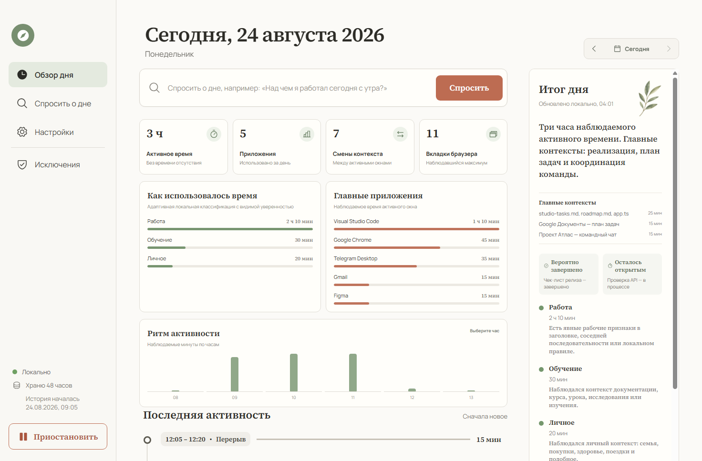

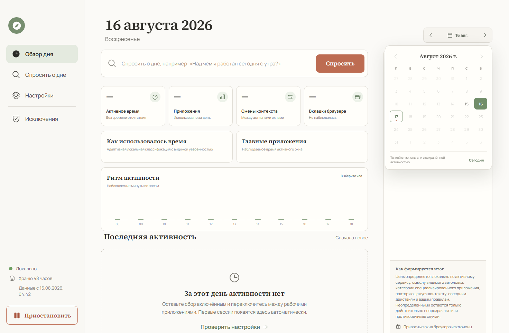

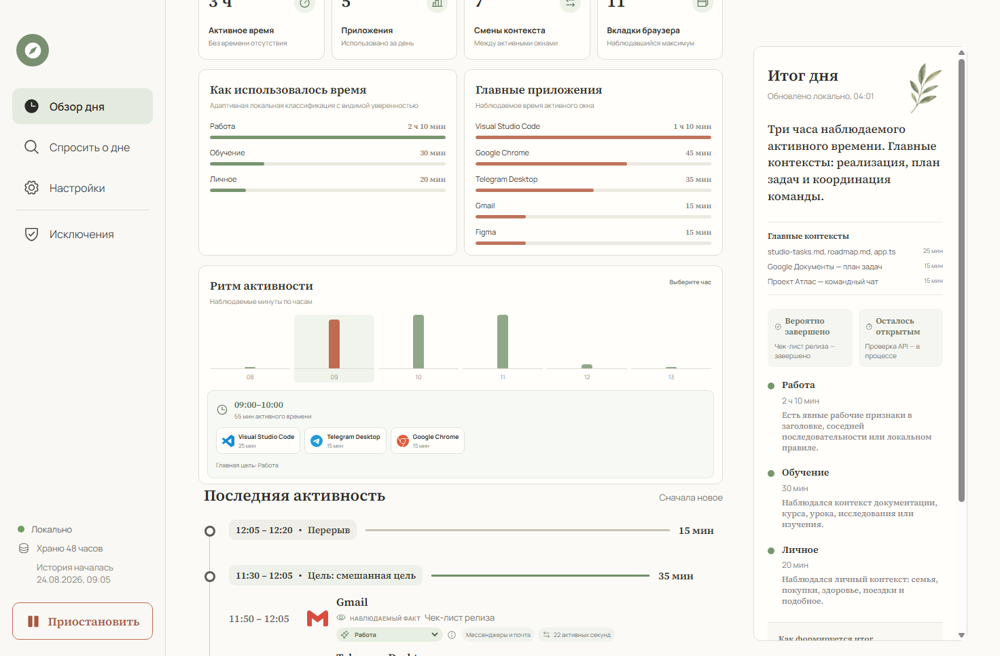

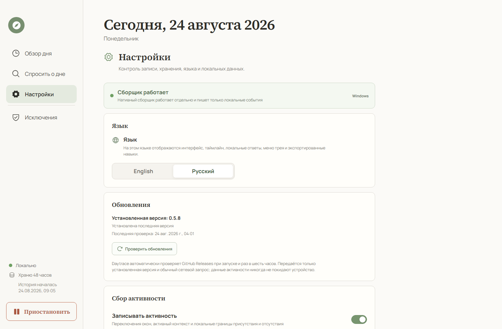

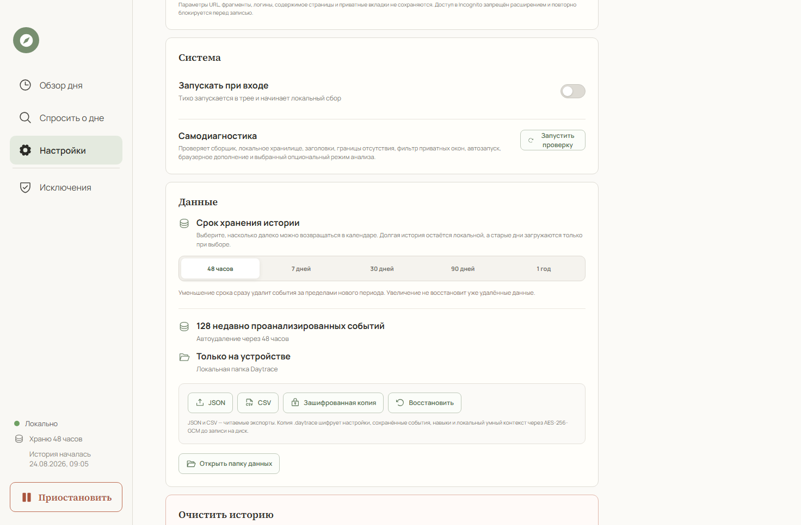

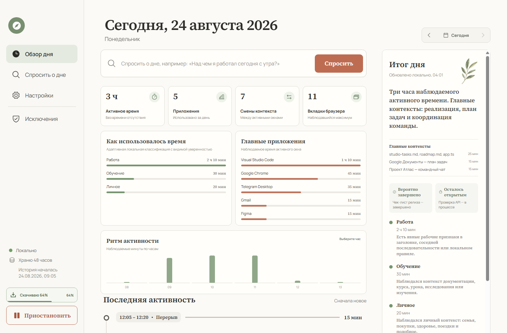

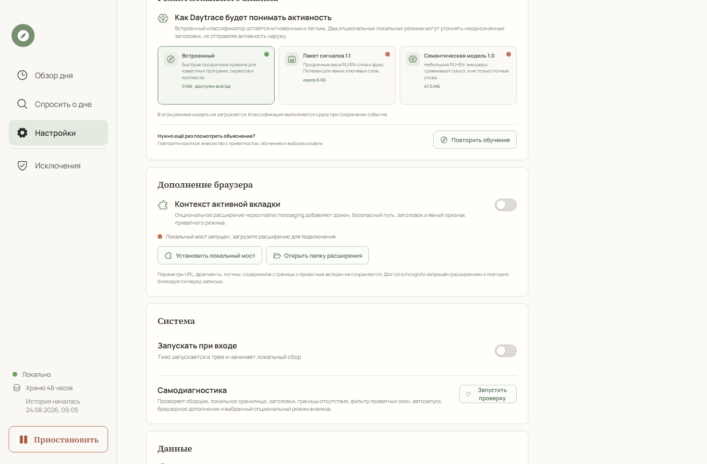

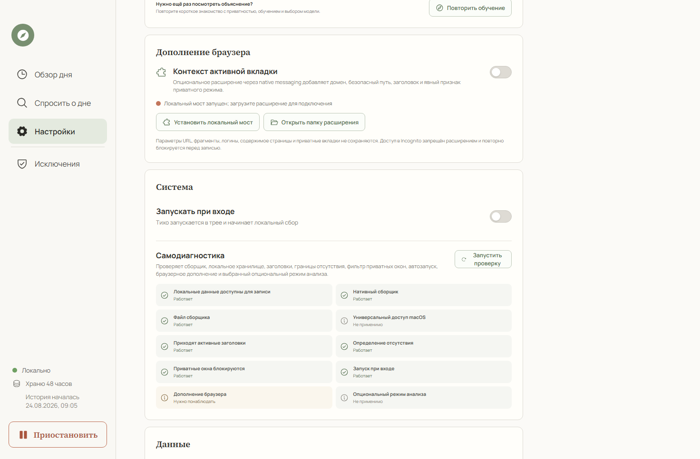

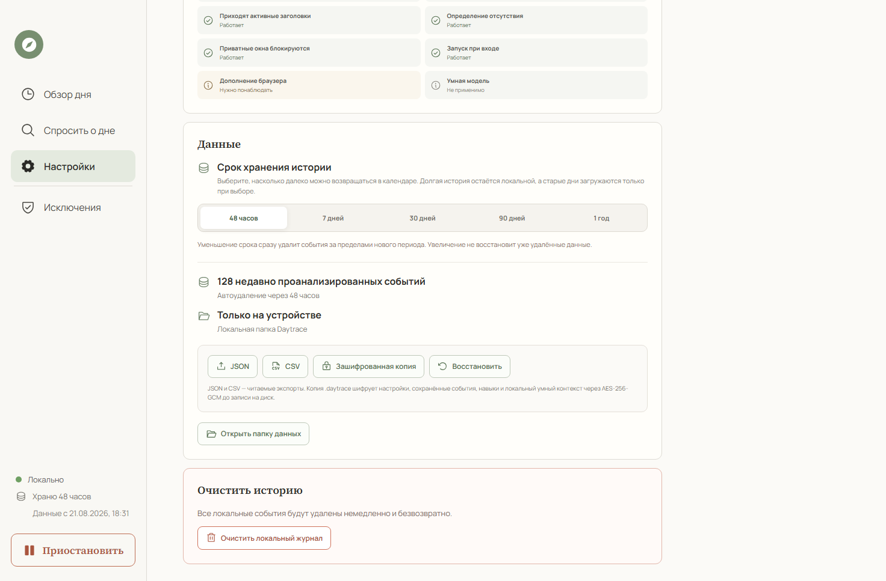

## Одна короткая настройка — дальше Daytrace учится локально

Версия 0.5.8 один раз показывает обновлённое обучение и новым, и уже существующим пользователям. Оно точно объясняет, что собирается и что не собирается, а затем предлагает три честных уровня анализа. Рекомендуемая семантическая модель опциональна, скачивается только после явного нажатия, проверяется по SHA-256 и выгружается после ограниченного прохода. Полноценная генеративная LLM не выдаётся за встроенную функцию.

Когда низкоуверенных событий становится достаточно много, Daytrace показывает одно уведомление внутри приложения, а не отвлекает постоянно. Повторы одной программы, страницы или чата группируются в один пункт. Подтверждённая правка сохраняется как локальное правило и повторно применяется только в той же области; до изменения таймлайна остаются предпросмотр и отмена.

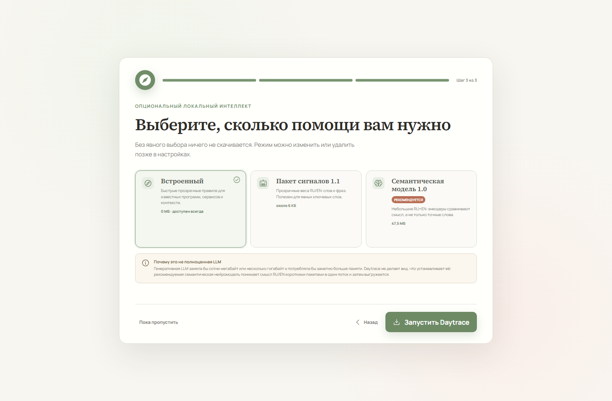

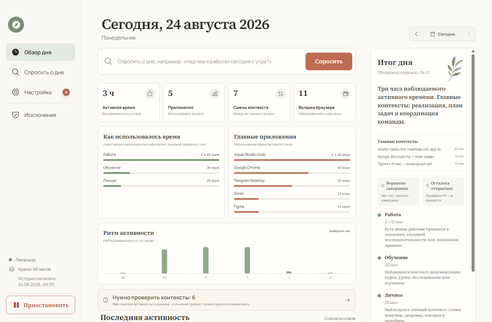

Этот же интерфейс полностью доступен [на английском](README.md), включая локальные итоги и меню системного трея.

## Цель, а не стереотип по приложению

Daytrace не считает «мессенджер» синонимом работы, а «браузер» — синонимом развлечения. У каждого интервала активного окна есть две независимые метки:

| Слой | Пример | На какой вопрос отвечает |
| --- | --- | --- |
| Тип активности | Мессенджер, браузер, разработка, звук | Какое приложение было активно? |
| Предполагаемая цель | Работа, обучение, личное, развлечения, неоднозначно | Для чего, вероятнее всего, использовался этот контекст? |

Цель определяется послойно: по распознанному активному сервису, смыслу видимого заголовка, категории специализированной программы, повторяющемуся контексту в настроенном локальном журнале, соседним действиям, преобладающей цели связного блока и правилам пользователя. Конкретный смысл важнее общего типа сервиса: лекция на YouTube считается обучением, YouTube Studio — работой, а обычный просмотр YouTube — развлечением. Противоречивые и действительно непрозрачные случаи остаются **«Неоднозначной целью»**; причина низкой уверенности и точные признаки видны в таймлайне и журнале проверки. Daytrace никогда не превращает неоднозначность в «Личное». Исправление сначала создаёт точное локальное правило и показывает его влияние; только после подтверждения пересчитываются таймлайн, графики, ответы и предложения навыков, а изменение можно отменить.

Это намеренно не анализ содержимого сообщений. Daytrace может определить активный чат Telegram «Проект Атлас — встреча с клиентом» по видимому названию и позже применить изученный локальный контекст, но не может узнать смысл непрозрачного названия без соседних действий или вашего исправления. Та же граница действует для браузерных страниц, документов, редакторов и любых других программ.

Изменения классификатора защищены версионированным синтетическим RU/EN-набором для браузеров, мессенджеров, IDE, игр, видео, документов, встреч и обучения. CI требует не менее 90% покрытия, не менее 94% точности среди классифицированных примеров, не менее 90% правильных ответов на каждом языке и ни одной принудительной метки для явно неоднозначных случаев. У семантического пакета есть дополнительный двуязычный набор смысловых примеров и реальная Electron/WASM-проверка. Это защита от регрессий, а не обещание понять любой реальный заголовок.

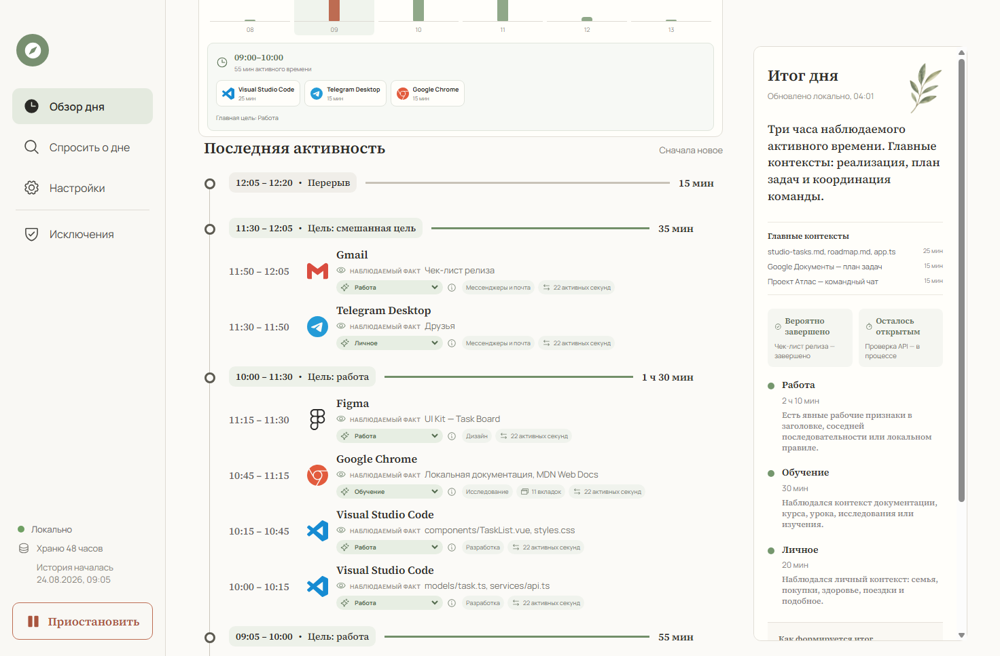

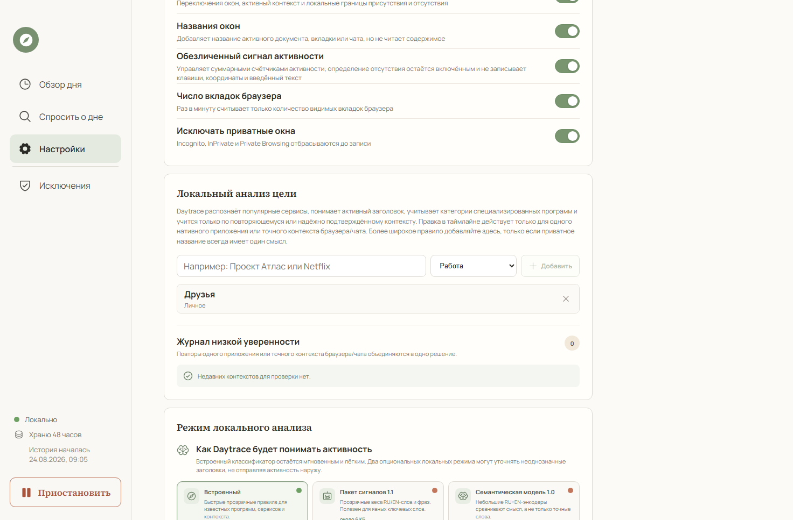

## Модель приватности

Daytrace намеренно собирает меньше данных, чем приложения со скриншотами рабочего стола.

| Записывается локально | Никогда не записывается |
| --- | --- |
| Имя активного приложения | Скриншоты и видео экрана |
| Заголовок активного окна | Аудио и микрофон |
| Число видимых вкладок браузера | Полные URL, параметры, фрагменты и названия фоновых вкладок |
| Опционально: домен и безопасный путь активной вкладки | Содержимое страниц, cookies, логины и значения полей |
| Время переключения окна | Содержимое буфера обмена |
| Обезличенные секунды активности в Windows | Координаты мыши |
| Суммарное число нажатий и кликов в macOS | Конкретные клавиши и введённый текст |
| Длительность сессии | Значения полей и пароли |

Заголовок окна может содержать название документа, страницы или диалога. Он остаётся локальным, но чувствительные приложения стоит добавить в исключения. Базовое определение приватного окна использует обозначения в заголовке, потому что accessibility API операционной системы не дают единого сигнала для всех браузеров. Опциональное Chromium-дополнение объявлено с `incognito: not_allowed`, блокирует приватную вкладку внутри расширения, а нативный мост повторяет проверку. Исключение приложения остаётся самой строгой защитой.

У Daytrace нет телеметрии и облачного анализа. Обновлятор обращается к официальному GitHub Releases только с номером установленной версии и сверяет артефакт с `SHA256SUMS.txt`. Если пользователь явно скачивает дополнительный компонент анализа, Daytrace получает файлы строго из релиза установленной версии и перед запуском проверяет их точный размер и встроенный в приложение SHA-256. События, заголовки, домены, вопросы, правила и настройки в эти запросы не входят. Семантический воркер разрешает только локальные файлы, а CSP интерфейса блокирует внешние соединения. Browser companion обменивается данными только через локальный пользовательский pipe/socket со случайным токеном.

Данные по умолчанию находятся здесь:

```text
%APPDATA%\daytrace-local\daytrace-data\
├── events\YYYY-MM-DD-HH.jsonl
├── settings.json
├── smart-contexts.json
├── models\                  # появляется только после выбора модели
└── skills\<workflow>\SKILL.md
```

Русский семантический энкодер относится к MIT-лицензированному семейству [`rubert-tiny-sts`](https://huggingface.co/VadimHursevich/rubert-tiny-sts-onnx) и динамически квантован в int8. Английский — Apache-2.0-лицензированный int8-экспорт [`paraphrase-MiniLM-L3-v2`](https://huggingface.co/sentence-transformers/paraphrase-MiniLM-L3-v2). Точные ревизии исходников, SHA-256, инструкция конвертации и тексты лицензий находятся рядом с файлами моделей в [`models/semantic`](models/semantic) и [`models/semantic-en`](models/semantic-en).

Удаление программы сохраняет эту папку, чтобы история не исчезла неожиданно. Для удаления журнала сначала используйте кнопку **«Удалить все данные»** внутри Daytrace.

## Как это работает

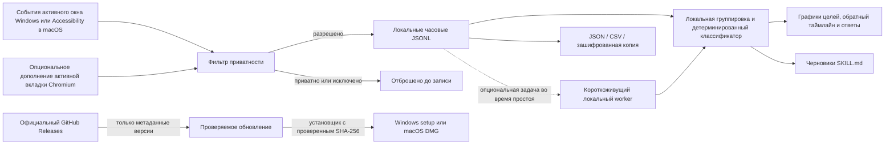

Нативный трекер передаёт смены активного окна, раз в несколько секунд проверяет только заголовок активного окна, пишет heartbeat с учётом простоя, раз в минуту считывает числовое количество вкладок в Windows и сохраняет только обезличенные агрегаты активности. Обе платформы определяют пять минут без системного ввода и записывают локальные границы idle/resume. Windows-сборщик не использует глобальные перехватчики клавиатуры и мыши. Локальный основной процесс Electron применяет правила приватности, хранит часовые JSONL-сегменты и передаёт состояние изолированному интерфейсу через IPC-мост с проверкой отправителя; навигация ограничена упакованным локальным интерфейсом. Он не читает тексты сообщений, введённый текст, координаты указателя и названия фоновых вкладок. При включённом browser companion логины, параметры и фрагменты URL удаляются до передачи домена и безопасного пути через локальный native messaging.

Длительность — это наблюдаемые интервалы активного окна, а не время, когда приложение просто оставалось открытым. Оставленная на ночь вкладка не соединяет вечер со следующим утром: явное событие простоя закрывает интервал, а дополнительный предел в шесть минут защищает старые журналы, сон и пробуждение компьютера и перезапуск сборщика. Минутные heartbeat при этом сохраняют пассивное чтение или просмотр видео, пока компьютер используется. Повторяющиеся события заголовка объединяются, фрагменты короче секунды и системные окна игнорируются, а обзор считает категорию каждой активности отдельно.

Для локальных ответов LLM не используется. Детерминированный анализатор на устройстве распознаёт точные и относительные даты, сравниваемые периоды, время, приложение, цель и тип вопроса — сводку, длительность, последнюю активность, вкладки или переключения — и рассчитывает ответ по локальным сессиям. Опциональный сигнальный или семантический режим может улучшить метки цели, используемые в этих ответах, но не генерирует текст, не получает сырой журнал, не остаётся в памяти и не делает сетевые inference-запросы. Над ответом показывается, как именно был понят вопрос.

## Нагрузка на систему

Daytrace использует нативные события активного окна и редкие замеры вместо скриншотов и постоянного сканирования экрана. На тестовом Windows-компьютере упакованная версия v0.4.0 показала **0,039% общей фоновой нагрузки CPU** за 30 секунд и **199 МиБ суммарной рабочей памяти** Electron и нативного сборщика без процесса интерфейса. Чистый запуск упакованного приложения дошёл до проверенного непустого окна за **1,14 с**. Обновления добавляют один небольшой запрос метаданных после запуска и затем не чаще одного раза в шесть часов при наличии интернета; постоянного сетевого опроса нет. Результат зависит от компьютера, антивируса, количества событий и ОС; сборка macOS проверяется в CI, но сопоставимые замеры на физическом Mac ещё собираются.

Browser companion работает от событий и не использует цикл опроса. Его native bridge запускается только для одной передачи контекста активной вкладки и сразу завершается, поэтому расширение не оставляет второй процесс Electron постоянно в памяти. По умолчанию выбран встроенный режим без загрузки модели. Опциональный сигнальный или семантический проход ждёт не менее двух минут простоя, обрабатывает ограниченную пачку и завершает worker. В Windows-smoke-тесте Electron/WASM двуязычный семантический проход проверил два неоднозначных контекста за **2,87 с**: приватная память всего фонового дерева процессов временно выросла с **150,0 до 569,8 МиБ**, после чего скрытый процесс анализа был уничтожен. Это намеренно консервативный тест RU+EN, а не постоянная фоновая нагрузка; проход для одного языка может быть легче, а результат зависит от компьютера. Старые дни и годовая история загружаются лениво, а не анализируются постоянно.

Путь длинной истории v0.5.5 отдельно проверен на синтетическом годовом архиве из **8 760 часовых файлов** на тестовом Windows-компьютере. Открытие хранилища заняло **63,3 мс**, построение ограниченного свежими данными состояния — **106,2 мс**, а ответ на вопрос только о сегодняшнем дне — **28,7 мс** при чтении всего **48 свежих событий**. Это замер хранилища и анализа, а не полного запуска приложения; он подтверждает, что выбор хранения за год не превращает весь архив в постоянную фоновую обработку.

Нативный Windows-сборщик остаётся self-contained, поэтому пользователю не нужно отдельно устанавливать .NET. Облегчённая публикация v0.5.5 сохраняет ReadyToRun для быстрого старта, но убирает отладочные данные и неиспользуемые локализации фреймворка, уменьшая проверенный объём с **160,1 МиБ / 464 файлов до 144,5 МиБ / 242 файлов**.

## Текущие ограничения

- Windows x64 проверен на Windows 10/11. Универсальная macOS-сборка рассчитана на macOS 12+ и проверяется в CI; покрытие реальных Mac пока нужно расширять.
- Локальные ответы детерминированы и основаны на правилах; опциональные сигнальный и семантический уточнители не являются разговорными LLM.
- Базовый сбор анализирует только активное приложение и видимый заголовок. Опциональное дополнение добавляет домен и безопасный путь активной вкладки Chrome, Edge, Brave или Vivaldi, но не читает содержимое страницы и фоновые вкладки. Firefox и Safari это дополнение не используют.
- Базовое определение приватного режима зависит от обозначений в заголовке и не гарантируется для каждой версии браузера. Приватный признак дополнения блокируется, но для чувствительных программ безопаснее использовать исключения.
- Сырые локальные журналы защищены правами учётной записи ОС, но отдельно на диске не шифруются; для защиты выключенного устройства используйте BitLocker или FileVault. Экспортируемые `.daytrace`-копии шифруются пользовательским паролем.
- Chromium не позволяет Daytrace тихо установить распакованное расширение. Приложение регистрирует локальный native host и открывает точную папку дополнения; один раз загрузить её на странице расширений должен пользователь. Доступ в Incognito намеренно недоступен.
- Для транзакционного Windows-обновления временно нужно место под одну подготовленную копию приложения: не менее 512 МиБ, обычно размер установленной версии плюс запас 128 МиБ. Если штатный архиватор Windows недоступен, папка установки защищена или места недостаточно, Daytrace не меняет текущую установку и открывает проверенный Setup для ручного подтверждения.
- Установщик пока не подписан сертификатом.

Мы описываем ограничения прямо: privacy-продукт должен ясно говорить, что он способен доказать, а что нет.

## Сборка из исходников

Понадобятся Node.js 22+ и npm. Для Windows-сборки также нужен .NET 8 SDK, для macOS — Xcode Command Line Tools.

```powershell
git clone https://github.com/CaspianG/daytrace.git
cd daytrace
npm ci
npm run dev:desktop
```

Опциональный контекст активной вкладки устанавливается через **Настройки → Дополнение браузера**. Daytrace регистрирует пользовательский native host и открывает встроенную папку расширения. В Chrome/Edge/Brave/Vivaldi включите режим разработчика, выберите **«Загрузить распакованное расширение»** и укажите эту папку. Доступ в Incognito не включайте; manifest также запрещает его.

Проверка и сборка установщика вместе с portable-архивом:

```powershell
npm test
npm run test:accuracy
npm run test:desktop
npm run test:sites
npm run dist
```

В Windows используйте `npm run dist:win`, а на macOS — `npm run dist:mac`.
Команда `npm run screenshots` заново создаёт все английские и русские изображения README. `npm run clean:check` показывает план очистки, а `npm run clean` удаляет только разрешённые генерируемые результаты (`dist`, `release`, coverage/test results, кэш Vite и папки нативной сборки), предварительно проверяя, что каждый путь остаётся внутри репозитория.

Артефакты появятся в `release/`:

- `Daytrace-Setup-<version>-x64.exe`
- `Daytrace-Portable-<version>-x64.zip`
- `Daytrace-<version>-macOS-universal.dmg`
- `Daytrace-<version>-macOS-universal.zip`

## Статус проекта

Daytrace — ранний публичный релиз. Privacy-граница, хранение, двуязычный интерфейс, цикл установки и запуск приложения проверены; более широкое покрытие браузеров ещё требует тестирования сообществом.

Issue и небольшие pull request приветствуются. Перед изменением сбора или privacy-логики прочитайте [CONTRIBUTING.md](CONTRIBUTING.md).

## Лицензия

[MIT](LICENSE) © участники проекта Daytrace.
