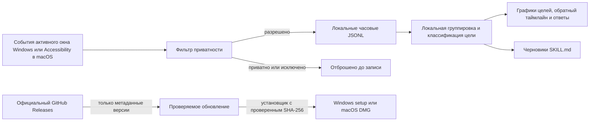

<p align="center">
  
</p>

<h1 align="center">Daytrace</h1>

<p align="center"><strong>Ваш день. На вашем устройстве.</strong></p>

<p align="center">
  Бесплатное приложение для Windows и macOS с открытым кодом: превращает локальную активность в понятную историю рабочего дня — без скриншотов, аудио, аккаунта, API и облачного хранения.
</p>

<p align="center">
  <a href="https://github.com/CaspianG/daytrace/releases/latest"><strong>Скачать для Windows</strong></a>
  · <a href="docs/MACOS_INSTALL_RU.md"><strong>Установить на macOS</strong></a>
  · <a href="README.md">English</a>
  · <a href="SECURITY.md">Безопасность</a>
</p>

<p align="center"><strong>Текущий релиз: v0.5.4</strong> — версии для Windows и macOS собираются из одного тега и публикуются одновременно.</p>

> **Важно перед первым запуском на macOS:** текущая версия для Mac бесплатна и полностью локальна, но не подписана и не нотарифицирована, потому что у проекта нет учётных данных Apple Developer ID. Поэтому Gatekeeper покажет предупреждение. Перед скачиванием откройте [безопасную инструкцию по установке на macOS](docs/MACOS_INSTALL_RU.md): она использует штатные пункты **«Открыть»** / **«Всё равно открыть»** и не отключает Gatekeeper.

<p align="center">
  
  
  
  
</p>


## Зачем нужен Daytrace

Вопрос простой: **«Над чем я работал сегодня с утра?»** Ответ обычно разбросан между редактором, вкладками браузера, документами, чатами и десятками переключений окон.

Анонс Computer History от OpenAI подтвердил, что такой класс инструментов действительно нужен. Первоначальный запуск был описан как функция только для macOS на тарифах Pro, Business и Enterprise. Daytrace — независимая кросс-платформенная альтернатива для тех, кому нужна эта польза без подписки и без доверия удалённому хранилищу активности.

Daytrace не требует аккаунта или API-ключа. Сбор, фильтрация, группировка, ответы и удаление происходят на вашем компьютере. Единственная встроенная сетевая функция — обновления: приложение проверяет официальный GitHub Releases по номеру установленной версии и никогда не передаёт данные активности.

> Доступность и тарифы Computer History могут измениться после первоначального анонса. Daytrace не связан с OpenAI и не одобрен компанией OpenAI.

## Установка через понятный мастер

1. Откройте [последний релиз](https://github.com/CaspianG/daytrace/releases/latest).
2. Скачайте `Daytrace-Setup-…-x64.exe`.
3. Запустите файл двойным кликом. Выберите русский или английский язык, папку установки и нужен ли ярлык на рабочем столе. Ярлык в меню «Пуск» добавляется автоматически.

Не нужны права администратора, отдельная установка .NET, расширение браузера, облачный аккаунт или API-ключ.

Текущая публичная сборка пока не подписана сертификатом, поэтому SmartScreen может показать **«Неизвестный издатель»**. Перед запуском можно сверить SHA-256 из описания GitHub Release.

Нужна portable-версия? Скачайте `Daytrace-Portable-…-x64.zip`, распакуйте и запустите `Daytrace.exe`.

На macOS 12 или новее сначала прочитайте [инструкцию по установке на macOS](docs/MACOS_INSTALL_RU.md), затем скачайте универсальный `Daytrace-…-macOS-universal.dmg`. Одинаковое предупреждение и шаги будут на странице релиза и внутри открытого DMG. Перенесите Daytrace в «Программы», затем при первом запуске выберите **Control/правый клик → «Открыть»**. Если запуск всё ещё заблокирован, откройте **«Системные настройки» → «Конфиденциальность и безопасность» → «Всё равно открыть»**. Сообщение Gatekeeper ожидаемо: у проекта пока нет платного сертификата Apple Developer ID для подписи и нотарификации. Это не результат обнаружения вируса. Не отключайте Gatekeeper целиком.

После запуска приложение отдельно объяснит, зачем нужен «Универсальный доступ», и откроет точный раздел «Конфиденциальность и безопасность». Оставьте только одну установленную копию `/Applications/Daytrace.app`. Daytrace определяет запущенную копию и показывает её путь. Начиная с v0.5.4 встроенное обновление само заменяет установленное приложение и исправляет дубликат вроде `Daytrace 2.app`, возвращая каноническое имя. Можно продолжить без разрешения, но история останется пустой, пока доступ не будет выдан. Перед открытием DMG сверьте его с `SHA256SUMS.txt` из того же релиза.

При сворачивании или закрытии окна тяжёлый renderer выгружается, а лёгкий нативный сборщик продолжает работу через системный трей. Чтобы вернуть то же окно без запуска дублей, дважды нажмите значок в трее или снова запустите Daytrace.

Установленная версия проверяет стабильные обновления вскоре после запуска и раз в шесть часов при наличии интернета. Ручная проверка находится в **Настройки → Обновления → Проверить обновления**. Компактный статус слева снизу показывает проверку, процент скачивания, проверку файла, установку, перезапуск или понятную ошибку — открывать настройки не нужно. В Windows Daytrace проверяет установщик, сохраняет текущую папку, тихо обновляется и автоматически открывается снова. Начиная с v0.5.4 в macOS приложение проверяет универсальный DMG, сверяет версию внутри, само заменяет установленное приложение, удаляет номерной дубликат и открывает каноническую копию. Finder появляется только как запасной сценарий, если macOS не разрешила автоматическую замену. При переходе с v0.5.3 или более старой версии нужно один раз выполнить описанную замену через DMG, потому что в этих уже установленных версиях нового механизма ещё нет.

## Возможности

- **Полный обзор дня**: активное время, приложения, смены контекста, максимум вкладок браузера, распределение фокуса, главные приложения и интерактивный почасовой ритм с деталями приложений и цели выбранного часа.
- **Таймлайн от нового к старому**, сгруппированный в фокус-сессии, с плавным переключением дней, настоящей выбранной датой в шапке и календарём в стиле приложения, где отмечены дни с сохранённой активностью.
- **Явные границы отсутствия**: пять минут без системного ввода закрывают активный интервал, возвращение в то же окно начинает новый, а промежутки между сессиями показываются как локализованные записи «Перерыв».
- **Локальные вопросы о дне**: утро, день, вечер, сегодня, вчера и вопросы о цели, например «Сколько времени я учился?».
- **Итог выбранного дня**, где работа, обучение, личное, развлечения и честно неопределённое время считаются отдельно.
- **Расширенный контекст приложений** через нативные accessibility-сигналы Windows и macOS: смены активной вкладки Chrome, числовое количество вкладок, смены активного окна или чата Telegram и время чтения без кликов.
- **Фильтрация приватных окон** по типичным заголовкам Incognito, InPrivate и Private Browsing до записи на диск.
- **Исключения приложений**; менеджеры паролей исключены по умолчанию.
- **Настраиваемое локальное хранение**: 48 часов по умолчанию либо 7, 30, 90 или 365 дней с точным автоудалением. Старые дни загружаются только при выборе, поэтому длинный архив не анализируется постоянно в фоне.
- **Пауза, удаление сессии и полная очистка** из приложения.
- **Поиск повторяющихся потоков** с экспортом проверяемого черновика `SKILL.md`.
- **Полная локализация на русский и английский**: интерфейс, таймлайн, ответы, меню трея, установщик и экспортируемые навыки.
- **Выбор языка при первом запуске** и мгновенное переключение позже в настройках.
- **Пошаговая настройка разрешения macOS** с нативным запросом «Универсального доступа», прямой ссылкой в системные настройки и автоматическим определением выданного доступа.
- **Автозапуск при входе** в Windows и macOS с тихим стартом в трее или строке меню.
- **Встроенные проверяемые обновления**: автоматическая проверка при наличии интернета, ручная кнопка в настройках, прогресс скачивания и действие слева снизу только для новой стабильной версии.
- **Раздельные настройки сбора** названий окон, обезличенного сигнала активности, числа вкладок и фильтра приватных окон.
- **Два независимых слоя классификации**: тип приложения и предполагаемая цель. Telegram может быть работой или личным общением; браузер — работой, обучением, развлечением или неопределённым контекстом.
- **Адаптивный локальный анализ цели** для популярных видео-, стриминговых, социальных, торговых, учебных, рабочих, офисных, творческих и коммуникационных сценариев с уверенностью и причиной каждого вывода. Непрозрачный контекст получает предварительную оценку с низкой уверенностью вместо массовой метки «цель не определена».
- **Точные границы ручной правки**: изменение нативной программы действует только на неё, а изменение страницы браузера или чата — только на точное сочетание приложения и заголовка и никогда не перекрашивает соседние действия.
- **Более широкое понимание видимого контекста** для популярных игр и игровых процессов, технической работы, отладки, установки, инфраструктуры, поисковых запросов, сравнений и справочных страниц на русском и английском.
- **Локальные исправления в один клик** прямо в таймлайне и правила по фрагменту названия чата, страницы, проекта или ключевой фразы. Правила не покидают устройство.


Этот же интерфейс полностью доступен [на английском](README.md), включая локальные итоги и меню системного трея.

## Цель, а не стереотип по приложению

Daytrace не считает «мессенджер» синонимом работы, а «браузер» — синонимом развлечения. У каждого интервала активного окна есть две независимые метки:

| Слой | Пример | На какой вопрос отвечает |
| --- | --- | --- |
| Тип активности | Мессенджер, браузер, разработка, звук | Какое приложение было активно? |
| Предполагаемая цель | Работа, обучение, личное, развлечения, неизвестно | Для чего, вероятнее всего, использовался этот контекст? |

Цель определяется послойно: по распознанному активному сервису, смыслу видимого заголовка, категории специализированной программы, повторяющемуся контексту в настроенном локальном журнале, соседним действиям, преобладающей цели связного блока и правилам пользователя. Конкретный смысл важнее общего типа сервиса: лекция на YouTube считается обучением, YouTube Studio — работой, а обычный просмотр YouTube — развлечением. Противоречивые и действительно непрозрачные случаи получают метку **«Цель не определена»** с видимой причиной низкой уверенности. Цель любой записи можно исправить селектором в таймлайне: Daytrace сохранит локальное правило и пересчитает таймлайн, графики, ответы и предложения навыков.

Это намеренно не анализ содержимого сообщений. Daytrace может определить активный чат Telegram «Проект Атлас — встреча с клиентом» по видимому названию и позже применить изученный локальный контекст, но не может узнать смысл непрозрачного названия без соседних действий или вашего исправления. Та же граница действует для браузерных страниц, документов, редакторов и любых других программ.


## Модель приватности

Daytrace намеренно собирает меньше данных, чем приложения со скриншотами рабочего стола.

| Записывается локально | Никогда не записывается |
| --- | --- |
| Имя активного приложения | Скриншоты и видео экрана |
| Заголовок активного окна | Аудио и микрофон |
| Число видимых вкладок браузера | URL и названия фоновых вкладок |
| Время переключения окна | Содержимое буфера обмена |
| Обезличенные секунды активности в Windows | Координаты мыши |
| Суммарное число нажатий и кликов в macOS | Конкретные клавиши и введённый текст |
| Длительность сессии | Значения полей и пароли |

Заголовок окна может содержать название документа, страницы или диалога. Он остаётся локальным, но чувствительные приложения стоит добавить в исключения. Определение приватного окна основано на заголовке, потому что универсального сигнала для всех браузеров нет; исключение приложения — более строгая защита.

Обновления — единственный встроенный сетевой контур. Обычно Daytrace запрашивает `api.github.com/repos/CaspianG/daytrace/releases/latest` и указывает `Daytrace/<установленная версия>` в user agent. Если лимит анонимного API исчерпан, используется публичная лента Releases и `SHA256SUMS.txt`. События журнала, заголовки, вопросы, правила и настройки не передаются. Приложение принимает только точный ожидаемый артефакт из официального репозитория и перед открытием сверяет опубликованный SHA-256.

Данные по умолчанию находятся здесь:

```text
%APPDATA%\daytrace-local\daytrace-data\
├── events\YYYY-MM-DD-HH.jsonl
├── settings.json
└── skills\<workflow>\SKILL.md
```

Удаление программы сохраняет эту папку, чтобы история не исчезла неожиданно. Для удаления журнала сначала используйте кнопку **«Удалить все данные»** внутри Daytrace.

## Как это работает



Нативный трекер передаёт смены активного окна, раз в несколько секунд проверяет только заголовок активного окна, пишет heartbeat с учётом простоя, раз в минуту считывает числовое количество вкладок в Windows и сохраняет только обезличенные агрегаты активности. Обе платформы определяют пять минут без системного ввода и записывают локальные границы idle/resume. Windows-сборщик не использует глобальные перехватчики клавиатуры и мыши. Локальный основной процесс Electron применяет правила приватности, хранит часовые JSONL-сегменты и передаёт состояние изолированному интерфейсу через узкий IPC-мост. Он не читает тексты сообщений, введённый текст, URL, координаты указателя и названия фоновых вкладок. Облачного сервера нет; сеть используется только для метаданных релиза и скачивания проверенного установщика.

Длительность — это наблюдаемые интервалы активного окна, а не время, когда приложение просто оставалось открытым. Оставленная на ночь вкладка не соединяет вечер со следующим утром: явное событие простоя закрывает интервал, а дополнительный предел в шесть минут защищает старые журналы, сон и пробуждение компьютера и перезапуск сборщика. Минутные heartbeat при этом сохраняют пассивное чтение или просмотр видео, пока компьютер используется. Повторяющиеся события заголовка объединяются, фрагменты короче секунды и системные окна игнорируются, а обзор считает категорию каждой активности отдельно.

Для локальных ответов LLM не используется. Детерминированный анализатор на устройстве распознаёт день и время, приложение, цель и тип вопроса — сводку, длительность, последнюю активность, вкладки или переключения — и рассчитывает ответ по локальным сессиям. В вопросы о работе, обучении, личном времени или развлечениях попадают только активности, подтверждённые классификатором и локальными правилами. Над ответом показывается, как именно был понят вопрос.

## Нагрузка на систему

Daytrace использует нативные события активного окна и редкие замеры вместо скриншотов и постоянного сканирования экрана. На тестовом Windows-компьютере упакованная версия v0.4.0 показала **0,039% общей фоновой нагрузки CPU** за 30 секунд и **199 МиБ суммарной рабочей памяти** Electron и нативного сборщика без процесса интерфейса. Чистый запуск упакованного приложения дошёл до проверенного непустого окна за **1,14 с**. Обновления добавляют один небольшой запрос метаданных после запуска и затем не чаще одного раза в шесть часов при наличии интернета; постоянного сетевого опроса нет. Результат зависит от компьютера, антивируса, количества событий и ОС; сборка macOS проверяется в CI, но сопоставимые замеры на физическом Mac ещё собираются.

## Текущие ограничения

- Windows x64 проверен на Windows 10/11. Универсальная macOS-сборка рассчитана на macOS 12+ и проверяется в CI; покрытие реальных Mac пока нужно расширять.
- Локальные ответы детерминированы и основаны на правилах — встроенной языковой модели нет.
- Daytrace анализирует только активное приложение и видимый заголовок активного окна. Он не читает сообщения, содержимое страниц, URL и названия фоновых вкладок, поэтому непрозрачный чат или страница всё ещё могут потребовать локального исправления.
- Определение приватного режима зависит от заголовков браузера и не может быть гарантировано для каждой версии.
- Установщик пока не подписан сертификатом.

Мы описываем ограничения прямо: privacy-продукт должен ясно говорить, что он способен доказать, а что нет.

## Сборка из исходников

Понадобятся Node.js 22+ и npm. Для Windows-сборки также нужен .NET 8 SDK, для macOS — Xcode Command Line Tools.

```powershell
git clone https://github.com/CaspianG/daytrace.git
cd daytrace
npm ci
npm run dev:desktop
```

Проверка и сборка установщика вместе с portable-архивом:

```powershell
npm test
npm run test:sites
npm run dist
```

В Windows используйте `npm run dist:win`, а на macOS — `npm run dist:mac`.

Артефакты появятся в `release/`:

- `Daytrace-Setup-<version>-x64.exe`
- `Daytrace-Portable-<version>-x64.zip`
- `Daytrace-<version>-macOS-universal.dmg`
- `Daytrace-<version>-macOS-universal.zip`

## Статус проекта

Daytrace — ранний публичный релиз. Privacy-граница, хранение, двуязычный интерфейс, цикл установки и запуск приложения проверены; более широкое покрытие браузеров ещё требует тестирования сообществом.

Issue и небольшие pull request приветствуются. Перед изменением сбора или privacy-логики прочитайте [CONTRIBUTING.md](CONTRIBUTING.md).

## Лицензия

[MIT](LICENSE) © участники проекта Daytrace.
