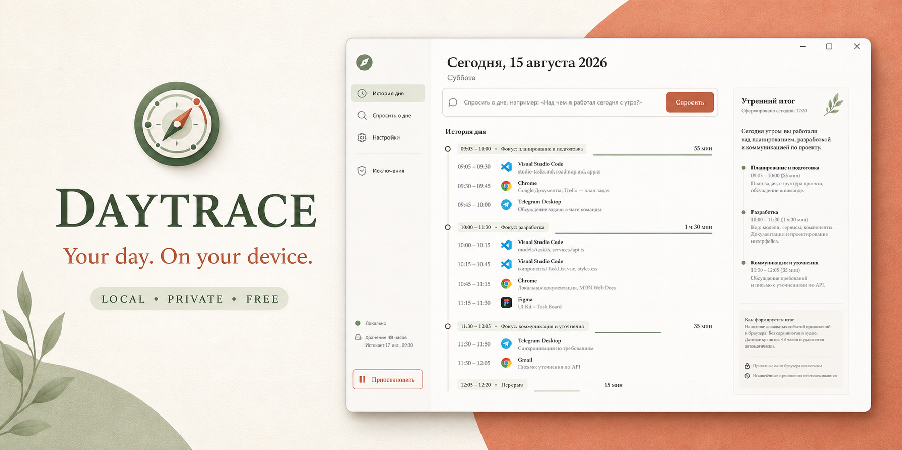
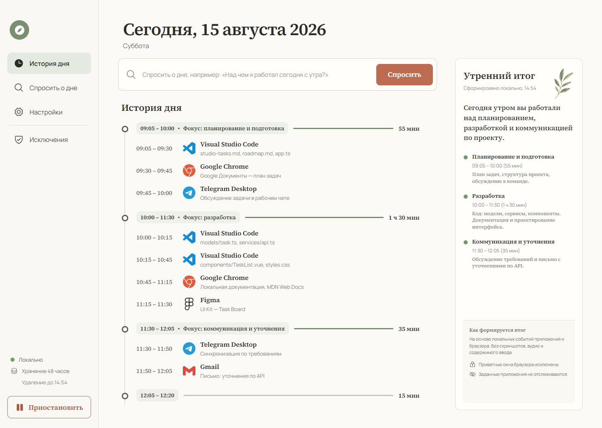
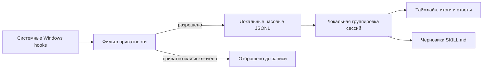

<p align="center">
  
</p>

<h1 align="center">Daytrace</h1>

<p align="center"><strong>Ваш день. На вашем устройстве.</strong></p>

<p align="center">
  Бесплатное Windows-приложение с открытым кодом: превращает локальную активность в понятную историю рабочего дня — без скриншотов, аудио, аккаунта, API и облачного хранения.
</p>

<p align="center">
  <a href="https://github.com/CaspianG/daytrace/releases/latest"><strong>Скачать для Windows</strong></a>
  · <a href="README.md">English</a>
  · <a href="SECURITY.md">Безопасность</a>
</p>



## Зачем нужен Daytrace

Вопрос простой: **«Над чем я работал сегодня с утра?»** Ответ обычно разбросан между редактором, вкладками браузера, документами, чатами и десятками переключений окон.

Анонс Computer History от OpenAI подтвердил, что такой класс инструментов действительно нужен. Первоначальный запуск был описан как функция только для macOS на тарифах Pro, Business и Enterprise. Daytrace — независимая Windows-first альтернатива для тех, кому нужна эта польза без подписки и без доверия удалённому хранилищу активности.

Daytrace не требует аккаунта или API-ключа. В релизной desktop-версии нет сетевой интеграции: сбор, фильтрация, группировка, ответы и удаление происходят на вашем компьютере.

> Доступность и тарифы Computer History могут измениться после первоначального анонса. Daytrace не связан с OpenAI и не одобрен компанией OpenAI.

## Установка в один клик

1. Откройте [последний релиз](https://github.com/CaspianG/daytrace/releases/latest).
2. Скачайте `Daytrace-Setup-…-x64.exe`.
3. Запустите файл двойным кликом. Daytrace установится для текущего пользователя, создаст ярлыки на рабочем столе и в меню «Пуск», затем откроется автоматически.

Не нужны права администратора, отдельная установка .NET, расширение браузера, облачный аккаунт или API-ключ.

Первая публичная сборка пока не подписана сертификатом, поэтому SmartScreen может показать **«Неизвестный издатель»**. Перед запуском можно сверить SHA-256 из описания GitHub Release.

Нужна portable-версия? Скачайте `Daytrace-Portable-…-x64.zip`, распакуйте и запустите `Daytrace.exe`.

## Возможности

- **Понятный таймлайн рабочего дня**, сгруппированный в фокус-сессии.
- **Локальные вопросы о дне**: утро, день, вечер, сегодня и вчера.
- **Утренний итог** с основными направлениями работы и длительностью.
- **Контекст приложений и окон** через системные Windows API.
- **Фильтрация приватных окон** по типичным заголовкам Incognito, InPrivate и Private Browsing до записи на диск.
- **Исключения приложений**; менеджеры паролей исключены по умолчанию.
- **Хранение 48 часов** с точным автоматическим удалением старых строк событий.
- **Пауза, удаление сессии и полная очистка** из приложения.
- **Поиск повторяющихся потоков** с экспортом проверяемого черновика `SKILL.md`.



## Модель приватности

Daytrace намеренно собирает меньше данных, чем приложения со скриншотами рабочего стола.

| Записывается локально | Никогда не записывается |
| --- | --- |
| Имя активного приложения | Скриншоты и видео экрана |
| Заголовок активного окна | Аудио и микрофон |
| Время переключения окна | Содержимое буфера обмена |
| Суммарное число кликов | Координаты мыши |
| Суммарное число нажатий | Конкретные клавиши и введённый текст |
| Длительность сессии | Значения полей и пароли |

Заголовок окна может содержать название документа, страницы или диалога. Он остаётся локальным, но чувствительные приложения стоит добавить в исключения. Определение приватного окна основано на заголовке, потому что универсального сигнала для всех браузеров нет; исключение приложения — более строгая защита.

Данные по умолчанию находятся здесь:

```text
%APPDATA%\daytrace-local\daytrace-data\
├── events\YYYY-MM-DD-HH.jsonl
├── settings.json
└── skills\<workflow>\SKILL.md
```

Удаление программы сохраняет эту папку, чтобы история не исчезла неожиданно. Для удаления журнала сначала используйте кнопку **«Удалить все данные»** внутри Daytrace.

## Как это работает



Нативный трекер передаёт смены активного окна и агрегированные счётчики ввода. Локальный main-процесс Electron применяет privacy-правила, хранит часовые JSONL и передаёт состояние изолированному интерфейсу через узкий IPC-мост. Облачного backend нет.

## Текущие ограничения

- Только Windows x64; проверено на Windows 10/11.
- Интерфейс и итоги пока ориентированы на русский язык.
- Локальные ответы детерминированы и основаны на правилах — встроенной языковой модели нет.
- Определение приватного режима зависит от заголовков браузера и не может быть гарантировано для каждой версии.
- Установщик v0.1.0 пока не подписан сертификатом.

Мы описываем ограничения прямо: privacy-продукт должен ясно говорить, что он способен доказать, а что нет.

## Сборка из исходников

Понадобятся Node.js 22+, npm и .NET 8 SDK.

```powershell
git clone https://github.com/CaspianG/daytrace.git
cd daytrace
npm ci
npm run dev:desktop
```

Проверка и сборка установщика вместе с portable-архивом:

```powershell
npm test
npm run test:sites
npm run dist
```

Артефакты появятся в `release/`:

- `Daytrace-Setup-<version>-x64.exe`
- `Daytrace-Portable-<version>-x64.zip`

## Статус проекта

Daytrace — ранний публичный релиз. Privacy-граница, хранение, цикл установки и запуск приложения проверены; покрытие браузеров и локализация ещё требуют тестирования сообществом.

Issue и небольшие pull request приветствуются. Перед изменением сбора или privacy-логики прочитайте [CONTRIBUTING.md](CONTRIBUTING.md).

## Лицензия

[MIT](LICENSE) © участники проекта Daytrace.
